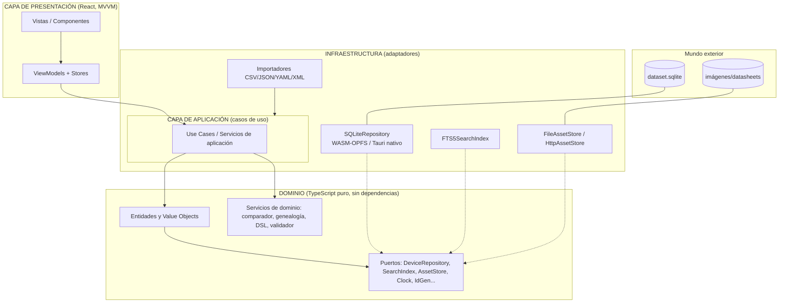
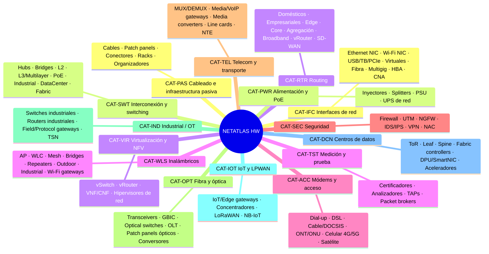
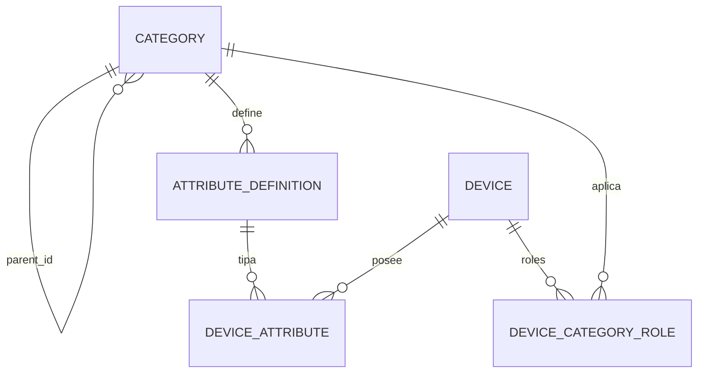
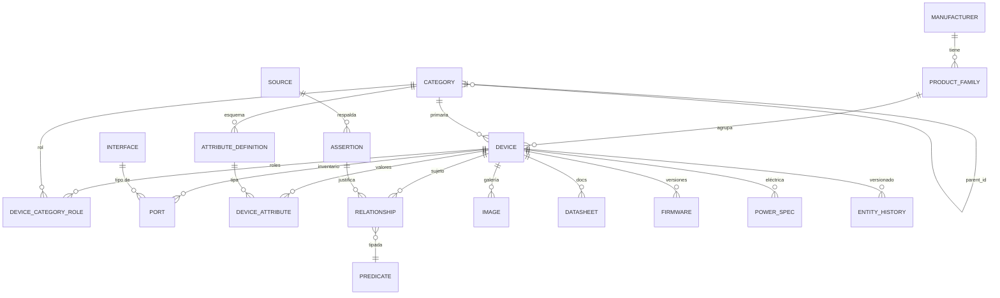

# PLAN MAESTRO — APLICACIÓN ENCICLOPÉDICA DE HARDWARE DE REDES

> **Nombre de trabajo del producto: NetAtlas**
> Documento de arquitectura, especificación funcional, hoja de ruta técnica y plan de implementación.
> Versión del documento: 1.0 · Estado: Aprobado para inicio de Fase 0 · Idioma canónico: español.

---

## Índice

1. [Resumen ejecutivo](#1-resumen-ejecutivo)
2. [Visión del producto](#2-visión-del-producto)
3. [Objetivos](#3-objetivos)
4. [Alcance](#4-alcance)
5. [Análisis de plataforma](#5-análisis-de-plataforma)
6. [Arquitectura recomendada](#6-arquitectura-recomendada)
7. [Taxonomía del hardware](#7-taxonomía-del-hardware)
8. [Modelo de conocimiento](#8-modelo-de-conocimiento)
9. [Modelo de datos](#9-modelo-de-datos)
10. [UX/UI](#10-uxui)
11. [Sistema de navegación](#11-sistema-de-navegación)
12. [Buscador avanzado](#12-buscador-avanzado)
13. [Diagramas y visualización](#13-diagramas-y-visualización)
14. [Catálogo de protocolos](#14-catálogo-de-protocolos)
15. [Catálogo de estándares](#15-catálogo-de-estándares)
16. [Medios de transmisión](#16-medios-de-transmisión)
17. [Historia y evolución tecnológica](#17-historia-y-evolución-tecnológica)
18. [Comparador de dispositivos](#18-comparador-de-dispositivos)
19. [Importación y gestión de datos](#19-importación-y-gestión-de-datos)
20. [Fuentes, confianza y trazabilidad](#20-fuentes-confianza-y-trazabilidad)
21. [Inteligencia artificial](#21-inteligencia-artificial)
22. [Seguridad](#22-seguridad)
23. [Rendimiento y escalabilidad](#23-rendimiento-y-escalabilidad)
24. [Plan de pruebas](#24-plan-de-pruebas)
25. [Documentación del proyecto](#25-documentación-del-proyecto)
26. [Estructura del repositorio](#26-estructura-del-repositorio)
27. [Roadmap](#27-roadmap)
28. [MVP](#28-mvp)
29. [Backlog](#29-backlog)
30. [Casos de uso](#30-casos-de-uso)
31. [Evolución futura](#31-evolución-futura)
32. [Riesgos](#32-riesgos)
33. [Decisiones arquitectónicas (ADRs)](#33-decisiones-arquitectónicas-adrs)
34. [Criterios de aceptación globales](#34-criterios-de-aceptación-globales)
35. [Conclusiones](#35-conclusiones)
36. [DECISIONES RECOMENDADAS](#decisiones-recomendadas)
37. [Anexo A — Matriz de trazabilidad del prompt maestro](#anexo-a--matriz-de-trazabilidad-del-prompt-maestro)

---

# 1. Resumen ejecutivo

**NetAtlas** es una enciclopedia técnica interactiva y un sistema de conocimiento especializado sobre hardware de redes de comunicaciones. No es una wiki, no es un catálogo comercial y no es un CRUD con buscador: es un **grafo de conocimiento técnico navegable** en el que dispositivos, fabricantes, familias, componentes, interfaces, protocolos, estándares, medios de transmisión, capas OSI/TCP-IP, tecnologías, topologías y evolución histórica son entidades de primera clase conectadas por relaciones tipadas, versionadas y respaldadas por fuentes.

**Propuesta de valor en una frase:** responder en segundos, con precisión de ingeniero y trazabilidad documental, preguntas como *"¿qué switches gestionables de 48 puertos con PoE+ y uplinks SFP28 soportan VXLAN y en qué capas operan?"*, *"¿qué sustituye hoy a este router discontinuado?"* o *"¿qué hardware necesito para un enlace de fibra monomodo de 10 km?"* — y mostrar la respuesta también **visualmente** (capas OSI, topologías, genealogía tecnológica, comparativas).

**Decisiones vertebrales** (desarrolladas y justificadas en el cuerpo del documento y consolidadas en [DECISIONES RECOMENDADAS](#decisiones-recomendadas)):

| Eje | Decisión principal |
|---|---|
| Plataforma | Híbrida: **núcleo web local-first** (PWA offline) + empaquetado de escritorio con **Tauri**; evolución a cliente-servidor sin reescritura |
| Stack | **TypeScript + React + Vite**, SQLite embebido, monorepo pnpm |
| Persistencia | **SQLite** relacional + tabla de aristas (grafo materializado); PostgreSQL como destino de sincronización futuro |
| Búsqueda | **SQLite FTS5** + filtros estructurados + mini-DSL; evolución a híbrida semántica con embeddings locales |
| Arquitectura | **Monolito modular hexagonal** (dominio puro, puertos/adaptadores, MVVM en presentación) |
| Diagramas | **SVG con Cytoscape.js** y layouts automáticos; exportación SVG/PNG |
| Datos | Cada dato técnico relevante es una **afirmación con fuente, nivel de confianza y fecha de verificación** |
| IA | Fase posterior: **RAG sobre la base validada** con citas obligatorias; nunca requisito de la v1 |

**Inversión estimada de la Fase 0 a la Fase 1 (MVP):** 4–6 semanas de investigación/arquitectura + 12–16 semanas de implementación MVP con un equipo de 1–2 personas. El roadmap completo (Fases 0–8) está detallado en la sección 27 con criterios de salida por fase.

**Lo que este documento es:** la referencia maestra durante todo el ciclo de desarrollo. Cualquier divergencia futura respecto a él se resuelve mediante ADR (sección 33) y actualización versionada de este documento.

---

# 2. Visión del producto

## 2.1 Definición

> **NetAtlas = enciclopedia técnica + explorador de conocimiento + catálogo de hardware + laboratorio visual de redes.**

Una aplicación profesional para **estudiar, consultar, clasificar, comparar, relacionar y visualizar** el hardware de redes de comunicaciones desde perspectivas educativa, profesional, técnica, histórica, arquitectónica, funcional, física, lógica, protocolaria y comparativa.

## 2.2 Principio rector

La aplicación se diseña como **sistema de conocimiento técnico especializado**, no como una aplicación CRUD. El activo central no son las pantallas sino el **modelo de conocimiento**: un grafo tipado, versionado y referenciado que representa:

```
dispositivos ↔ fabricantes ↔ familias ↔ componentes ↔ interfaces ↔ protocolos
↔ estándares ↔ capas (OSI/TCP-IP) ↔ tecnologías ↔ medios ↔ topologías
↔ versiones ↔ historia
```

Las pantallas, el buscador, el comparador, los diagramas y el futuro asistente de IA son **proyecciones** de ese modelo. Esta separación es lo que permite crecer durante años sin reconstruir la aplicación.

## 2.3 Audiencias

| Audiencia | Uso principal |
|---|---|
| Estudiantes de redes/telecom (CCNA, grado, FP) | Explorar dispositivos por función, capa OSI, historia; entender diferencias (hub→switch→multilayer) |
| Ingenieros de redes y sysadmins | Consulta rápida de specs, comparación, compatibilidades (transceivers, PoE, fibra), selección de hardware |
| Arquitectos y preventa | Topologías de referencia, sustitutos de hardware EoL, matrices de compatibilidad, exportación de informes |
| Formadores y documentalistas | Material visual (diagramas, timelines), fichas consistentes, glosario y genealogía tecnológica |
| Curadores de datos (el propio equipo) | Importación validada, trazabilidad de fuentes, control de calidad del conocimiento |

## 2.4 Personalidad del producto

Precisión, profundidad, profesionalidad, ingeniería, orden y sofisticación. La UI debe transmitir *instrumento técnico de laboratorio*, no *blog con buscador*. Densidad de información alta pero jerarquizada; cero adornos que no aporten lectura técnica.

## 2.5 Qué NO es (anti-objetivos de la v1)

- No es una tienda ni un comparador de precios en tiempo real (precio = dato opcional con fuente, nunca scraping comercial).
- No es un simulador de red tipo Packet Tracer/GNS3 (los laboratorios virtuales son evolución futura, sección 31).
- No es un repositorio de firmwares ni software de fabricante (solo metadatos de firmware y enlaces a fuente oficial).
- No depende de IA para funcionar: la IA es una capa posterior sobre la base validada (sección 21).

---

# 3. Objetivos

## 3.1 Objetivos de producto

| # | Objetivo | Medida de éxito |
|---|---|---|
| O1 | Cobertura taxonómica profesional del hardware de redes | ≥15 macrocategorías extensibles sin cambio estructural (sección 7) |
| O2 | Ficha técnica de referencia | 100% de dispositivos seed con ficha completa en las dimensiones aplicables y fuente por dato crítico |
| O3 | Navegación relacional no lineal | Desde cualquier entidad se alcanza cualquier entidad relacionada en ≤2 clics |
| O4 | Búsqueda técnica real | Resuelve las 7 consultas canónicas del brief (sección 12.6) en <500 ms sobre 10k dispositivos |
| O5 | Respuesta visual a preguntas de capa | "¿En qué capas opera?" respondida gráficamente para el 100% de categorías seed |
| O6 | Comparación rigurosa | Comparador N-dispositivos con detección automática de diferencias e (in)compatibilidades |
| O7 | Dimensión temporal | Timeline y genealogía tecnológica navegables (p. ej. hub→bridge→switch→…→programmable switch) |
| O8 | Trazabilidad total | Ningún dato crítico se muestra como certeza sin fuente y nivel de confianza asociados |
| O9 | Evolución sin reescritura | Pasar de dataset local a dataset sincronizado cambiando adaptadores, no dominio |
| O10 | Calidad de ingeniería | Cobertura prioritaria en dominio e importación; CI verde como condición de merge (sección 24) |

## 3.2 Objetivos de arquitectura

1. **Separación datos/presentación**: el dataset es un artefacto versionado e independiente de la app (distribuible y actualizable por separado).
2. **Extensibilidad por metadatos**: nuevas categorías, atributos por categoría, protocolos y estándares se añaden como **datos**, no como migraciones de código.
3. **Testabilidad**: el dominio es TypeScript puro sin dependencias de framework; la lógica crítica (comparador, DSL de búsqueda, validación de importación, genealogía) es unit-testeable al 100%.
4. **Portabilidad**: el mismo núcleo corre en navegador (PWA), escritorio (Tauri) y, en fase posterior, servidor (Node) con adaptadores de persistencia intercambiables.

## 3.3 No-objetivos

- Multiusuario, roles y colaboración en v1 (diseñado para ello en sección 31, sin implementarlo).
- Sincronización cloud en v1 (Fase 8).
- Soporte móvil nativo en v1 (la PWA es responsive; apps nativas son futuro).

---

# 4. Alcance

## 4.1 Ámbitos de red cubiertos

El modelo de conocimiento debe representar hardware de todos estos entornos; el **dataset seed** los prioriza según la columna "Fase de cobertura":

| Ámbito | Ejemplos de hardware | Fase de cobertura del dataset |
|---|---|---|
| Doméstico / SOHO | routers Wi-Fi, extensores, ONT, PLC | F1 (MVP) |
| PYME | switches gestionables, AP, firewall UTM | F1–F2 |
| Empresarial / campus | multilayer, WLC, NGFW, SD-WAN | F2 |
| Proveedores de servicio / operadores | OLT, BRAS/BNG, edge/core routers, DWDM | F3 |
| Centros de datos | ToR/leaf/spine, DPU/SmartNIC, fabric | F2–F3 |
| Industrial / OT | switches ruggedized, gateways de protocolo, TSN | F3 |
| IoT / LPWAN | gateways LoRaWAN/NB-IoT, edge gateways | F3 |
| Móvil / celular | CPE 4G/5G, small cells, fronthaul/backhaul | F3 |
| Fibra / óptico | transceivers (SFP→OSFP), OLT/ONT, ROADM | F2–F3 |
| Transporte | MUX/DEMUX, media converters, NTE | F3 |
| Virtualizado / cloud / edge | vRouter, vSwitch, NFV, edge appliances | F3 |
| Alta disponibilidad | chasis redundantes, stacking, fuentes N+1 | F2 |

Regla de scope: **el modelo soporta todo desde el día 1; el dataset crece por fases.** Nunca se recorta el modelo para ajustarlo al dataset disponible.

## 4.2 Alcance funcional por versión

| Capacidad | v1 (MVP) | v2–v3 | v4+ |
|---|---|---|---|
| Catálogo + fichas + fuentes | ✅ | ✅ | ✅ |
| Búsqueda FTS + facetas + DSL | ✅ | ✅ | ✅ |
| Vista OSI/TCP-IP por dispositivo | ✅ | ✅ | ✅ |
| Importación JSON/CSV validada | ✅ | ✅ | ✅ |
| Relaciones navegables | básicas | ✅ completa | ✅ |
| Timeline/genealogía | — | ✅ | ✅ |
| Diagramas interactivos | — | ✅ | ✅ |
| Comparador avanzado | — | ✅ | ✅ |
| Búsqueda semántica/RAG | — | — | ✅ |
| Sincronización / web pública / API | — | — | ✅ |

## 4.3 Límites explícitos

- **Precios**: solo como atributo opcional `msrp` con fuente y fecha; sin agregación comercial.
- **Datos personales**: ninguno en v1 (no hay cuentas). La futura capa de usuarios (favoritos, notas) se diseña en sección 31.
- **Exactitud**: la app distingue visualmente dato oficial / derivado / de terceros / experimental / histórico (sección 20) y nunca "inventa" especificaciones.

---

# 5. Análisis de plataforma

## 5.1 Las cuatro alternativas

**A. Aplicación web pura (SPA/PWA servida desde la nube o `localhost`).** El navegador es el runtime; los datos viven en un servidor o en almacenamiento del navegador.

**B. Aplicación de escritorio nativa.** Binario instalable por sistema operativo (p. ej. .NET/Avalonia, Qt/PySide, Electron/Tauri) con base de datos local.

**C. Aplicación híbrida / multiplataforma.** Un único núcleo web (HTML/CSS/TS) que corre como PWA en navegador y empaquetado como escritorio mediante un shell ligero (Tauri), compartiendo el 100% del código de UI y dominio; la persistencia se resuelve con una capa de adaptadores (SQLite nativo bajo Tauri, SQLite WASM/IndexedDB en navegador).

**D. Arquitectura cliente-servidor.** Backend con API (REST/GraphQL) + PostgreSQL; frontend web y cliente de escritorio consumen la API.

## 5.2 Matriz de evaluación

Escala 1–5 (5 = mejor). Pesos según la naturaleza del producto: conocimiento pesado, búsqueda intensiva, diagramas interactivos, vida larga, presupuesto acotado.

| Criterio | Peso | A. Web | B. Escritorio | C. Híbrida | D. Cliente-servidor |
|---|---|---|---|---|---|
| Rendimiento (búsqueda/render local) | 8% | 3 | 5 | 5 | 4 |
| Funcionamiento offline | 10% | 2¹ | 5 | 5 | 1 |
| Complejidad de construcción | 8% | 4 | 3 | 4 | 2 |
| Mantenimiento (una base de código) | 8% | 5 | 3 | 4 | 2 |
| Seguridad (superficie de ataque) | 5% | 3 | 4 | 4 | 3 |
| Almacenamiento local | 8% | 3² | 5 | 5 | 2 |
| Gráficos y diagramas interactivos | 9% | 5 | 3 | 5 | 5 |
| Búsqueda (FTS, índices, futuro vectorial) | 8% | 4 | 4 | 4 | 5 |
| Escalabilidad (catálogo 10k→1M) | 6% | 4 | 3 | 4 | 5 |
| Distribución e instalación | 7% | 5 | 2 | 4 | 4 |
| Actualización de app y dataset | 6% | 5 | 2 | 4 | 5 |
| Compatibilidad multiplataforma | 6% | 5 | 2 | 5 | 5 |
| Coste de desarrollo | 4% | 4 | 3 | 4 | 2 |
| Facilidad de evolución (años) | 3% | 4 | 3 | 5 | 4 |
| Futura versión web pública | 2% | 5 | 1 | 5 | 5 |
| Integración con bases de datos | 1% | 3 | 4 | 4 | 5 |
| Futuras capacidades de IA | 1% | 4 | 3 | 4 | 5 |
| **Total ponderado** | **100%** | **3,72** | **3,32** | **4,48** | **3,55** |

¹ PWA con Service Worker + IndexedDB permite offline real, pero con cuotas y fricciones de almacenamiento persistente en algunos navegadores.
² SQLite WASM con OPFS ofrece almacenamiento duradero de cientos de MB en navegadores modernos; sigue sin equivaler a un archivo de BD nativo portable.

## 5.3 Análisis por alternativa

### A. Web pura
**Ventajas:** distribución instantánea (URL), cero instalación, mejor ecosistema de visualización (SVG/Canvas/WebGL), actualización trivial, multiplataforma total.
**Inconvenientes:** offline frágil sin PWA bien hecha; cuotas de almacenamiento; el dataset completo (decenas de MB con imágenes) exige estrategia de caché agresiva; rendimiento de consultas complejas limitado si todo vive en IndexedDB "a pelo".

### B. Escritorio nativo
**Ventajas:** rendimiento y almacenamiento local sin límites prácticos, SQLite nativo, archivo de BD portable y respaldable, experiencia offline perfecta.
**Inconvenientes:** tres toolchains de UI si se quiere calidad nativa por SO (coste inasumible); distribución y firma de binarios; actualizaciones manuales; ecosistema de diagramación más pobre que el web; futura versión web implicaría reescritura de presentación.

### C. Híbrida (núcleo web + shell Tauri)
**Ventajas:** **un solo código** que sirve como PWA offline en navegador y como app de escritorio instalable con SQLite nativo, acceso a archivos locales (importación de CSV/datasheets) y actualizador firmado. El ecosistema web da los mejores diagramas y la mejor búsqueda embebible (FTS5 en SQLite corre igual en ambos modos). La evolución a web pública no requiere reescritura: el núcleo ya es web.
**Inconvenientes:** hay que disciplinar la capa de persistencia (adaptadores); Tauri exige toolchain Rust en CI (coste asumible); dos "sabores" de build que probar.

### D. Cliente-servidor
**Ventajas:** búsqueda y grafos a escala (PostgreSQL/Elasticsearch), futuro multiusuario y API pública naturales.
**Inconvenientes:** rompe el requisito offline y de "consulta personal sin servidor"; duplica frontend/backend desde el día 1 (coste); operación y seguridad de un servicio; para una enciclopedia de consulta individual es **sobreingeniería prematura** (principio 13, sección 33).

## 5.4 Recomendación

> **Opción C — Híbrida multiplataforma con núcleo web local-first**, diseñada desde la primera línea para evolucionar a **D** sin reescritura.

**Justificación técnica:**

1. **El dominio y el dataset son portátiles por diseño.** Toda la lógica vive en TypeScript puro (dominio hexagonal, sección 6) y toda la persistencia pasa por interfaces `DeviceRepository`, `SearchIndex`, `AssetStore`. En PWA el adaptador es SQLite WASM (wa-sqlite + OPFS); en escritorio, SQLite nativo vía Tauri; en Fase 8, un adaptador HTTP→PostgreSQL. El producto cambia de "forma" cambiando adaptadores, no código de dominio ni de UI.
2. **Los diagramas son requisito de primer orden** (sección 13) y el ecosistema web (SVG, Cytoscape.js, ELK, D3) es objetivamente superior al de cualquier toolkit nativo, con la mitad de coste.
3. **Offline real desde el MVP**: el dataset es un archivo SQLite versionado, descargable e importable; la app funciona sin red al 100% tras la primera carga/instalación.
4. **Distribución dual**: cualquier usuario abre la PWA; el usuario profesional instala el binario Tauri (≈10–20 MB vs. 150+ MB de Electron) con actualizaciones firmadas.
5. **Coste**: una base de código, un lenguaje, un equipo pequeño. La opción D duplica ese coste antes de tener validado el dominio.
6. **Puerta al futuro**: cuando el producto necesite web pública, colaboración o API, se despliega el **mismo núcleo** detrás de un adaptador servidor + PostgreSQL (secciones 23 y 31). La opción C no es un compromiso: es la secuencia correcta.

---

# 6. Arquitectura recomendada

## 6.1 Análisis de estilos arquitectónicos

| Estilo | Qué aporta | Qué cuesta | Veredicto para NetAtlas |
|---|---|---|---|
| **Clean Architecture** (círculos concéntricos) | Independencia total del dominio respecto a frameworks y BD | Boilerplate de mapeo entre capas | ✅ Base conceptual adoptada |
| **Arquitectura hexagonal** (puertos/adaptadores) | Persistencia, IA y shell (PWA/Tauri/servidor) intercambiables por interfaces | Disciplina estricta de puertos | ✅ Adoptada: es la que hace real la opción C |
| **MVVM** | Binding declarativo, ViewModels testeables, separación vista/estado | Curva leve en React (hooks + stores) | ✅ Adoptado en presentación |
| MV* genérico (MVC/MVP clásico) | Familiaridad | Acoplamiento vista-lógica en SPA | ❌ Superado por MVVM+stores |
| **Monolito modular** | Un despliegue, módulos con fronteras explícitas, refactor barato | Exige gobernar dependencias entre módulos | ✅ Adoptado como estilo de empaquetado |
| Microservicios | Escalado y despliegue independientes | Red, consistencia, operación, coste ×3–5 | ❌ Sobreingeniería para una enciclopedia local-first |

**Recomendación: monolito modular con arquitectura hexagonal (Clean) y MVVM en presentación.** Justificación: maximiza simplicidad, mantenibilidad, rendimiento (todo local, sin red), modularidad y testabilidad —los cinco criterios del brief— y es la única combinación que permite que el mismo núcleo corra en PWA, Tauri y (futuro) servidor cambiando solo adaptadores.

## 6.2 Vista de capas



**Regla de dependencias:** las flechas apuntan siempre hacia el dominio. El dominio no importa nada de React, SQLite ni Tauri. La infraestructura implementa puertos; la composición (DI manual en `composition-root.ts`) cablea adaptadores concretos según el runtime (PWA / Tauri / test / futuro servidor).

## 6.3 Las diez capas/subsistemas exigidos y su responsabilidad

| Capa | Responsabilidad | Ubicación en el monorepo |
|---|---|---|
| Presentación | Componentes React, ViewModels, stores (Zustand), routing, temas | `apps/app/src/ui`, `packages/ui` |
| Aplicación | Casos de uso orquestadores (`GetDeviceSheet`, `CompareDevices`, `SearchCatalog`, `BuildTopology`, `ImportDataset`…) | `packages/app` |
| Dominio | Entidades, value objects, servicios puros (comparador, DSL, genealogía, OSI, validación) | `packages/domain` |
| Infraestructura | Adaptadores SQLite/FTS5/archivos/red, reloj, ids, logging | `packages/data`, `packages/search` |
| Persistencia | Esquema SQL, migraciones (versionadas), DAOs, transacciones | `packages/data/migrations` |
| Búsqueda | Índice FTS5, parser del DSL, facetas, ranking, (futuro) embeddings | `packages/search` |
| Visualización | Motor de diagramas (Cytoscape/SVG), timeline, panel OSI, exportación | `packages/diagrams` |
| Importación | Pipeline parse→normaliza→valida→dedup→reconcilia→persiste | `packages/importers` |
| Exportación | PDF/informes, CSV/JSON, PNG/SVG de diagramas | `packages/exporters` |
| Configuración | Preferencias, feature flags, rutas de dataset, temas | `packages/config` |

## 6.4 Módulos de dominio (bounded contexts)

`catalog` (Device, Manufacturer, ProductFamily, Category) · `taxonomy` (jerarquía y atributos por categoría) · `graph` (Relationship, proyecciones de grafo) · `protocols` · `standards` · `media` (medios de transmisión) · `layers` (OSI/TCP-IP) · `timeline` (historia/genealogía) · `compare` · `topologies` · `sourcing` (fuentes, afirmaciones, confianza) · `knowledge-versioning` (historial/estados) · `glossary` · `calculators` (PoE, óptica, subnetting).

Cada módulo exporta su API pública por `index.ts`; las dependencias entre módulos están permitidas solo "hacia abajo" (p. ej. `compare` puede depender de `catalog`, nunca al revés) y se verifican con `dependency-cruiser` en CI.

## 6.5 Flujo de ejemplo (lectura de una ficha)

1. El usuario abre `/device/aruba-2930f-48g-poeplus`.
2. Router → `DeviceSheetView` → ViewModel `useDeviceSheet(slug)`.
3. ViewModel invoca caso de uso `GetDeviceSheet`.
4. El caso de uso compone: `DeviceRepository.findBySlug` + `GraphRepository.neighbors` + `SourcingRepository.assertionsFor` + `LayerService.osiProfile`.
5. Adaptador SQLite ejecuta las consultas en una transacción de lectura; resultados se mapean a entidades de dominio.
6. El ViewModel proyecta un **view-model de ficha** (sin objetos vivos de infraestructura) y la vista renderiza pestañas.
7. Errores: `DeviceNotFound` → vista 404 contextual con sugerencias del buscador.

## 6.6 Puertos principales (contratos del dominio)

| Puerto | Métodos clave | Adaptador PWA | Adaptador Tauri | Futuro servidor |
|---|---|---|---|---|
| `DeviceRepository` | `findBySlug`, `findByIds`, `listByCategory`, `save` | SQLite WASM | SQLite nativo | HTTP API |
| `GraphRepository` | `neighbors`, `paths`, `edgesOf` | SQLite WASM | SQLite nativo | HTTP API / Cypher |
| `SearchIndex` | `query(dsl)`, `facets`, `suggest` | FTS5 WASM | FTS5 nativo | FTS/pgvector/ES |
| `AssetStore` | `getImage`, `putImage`, `getDatasheet` | OPFS/HTTP caché | FS local | S3/CDN |
| `DatasetManager` | `current`, `import`, `verify`, `migrate` | OPFS | FS local | Servicio de datasets |
| `Clock`, `IdGen`, `Logger` | utilidades | estándar | estándar | estándar |

## 6.7 Evolución a cliente-servidor (Fase 8) sin reescritura

1. Se publica un servicio Node que **reutiliza `packages/app` y `packages/domain`** tal cual, con un adaptador `PostgresRepository`.
2. El frontend cambia la composición: `DeviceRepository` pasa de SQLite local a `HttpRepository` (misma interfaz).
3. El dataset local queda como **caché offline sincronizable** (estrategia en sección 23.4): réplica de solo lectura + cola de contribuciones.
4. Nada del dominio, buscador (DSL), comparador, diagramas o UI cambia. Coste de la migración: adaptadores + API + auth, no reescritura.

## 6.8 Decisiones de detalle

- **Sin ORM pesado**: consultas SQL explícitas con un query-builder ligero (`kysely`) — control total de índices y FTS, cero magia, SQL portable a PostgreSQL.
- **Migraciones**: scripts SQL numerados (`0001_init.sql`, …) con tabla `schema_version`; el dataset declara su versión y la app migra al abrirlo.
- **Inmutabilidad de lecturas**: las entidades se devuelven congeladas (`Object.freeze`) para evitar mutaciones accidentales en ViewModels.
- **Errores tipados**: `Result<T, DomainError>` en vez de excepciones en casos de uso.

---

# 7. Taxonomía del hardware

## 7.1 Principios de la taxonomía

1. **Las categorías son datos, no código.** Añadir una categoría o subcategoría = insertar filas en `category` y (opcionalmente) un esquema de atributos en `attribute_definition`. Cero migraciones, cero redeploy (principio de extensibilidad, sección 33).
2. **Jerarquía de profundidad variable** mediante autorreferencia (`parent_id`); sin límite artificial de niveles, aunque el dataset canónico usa 2–4.
3. **Clasificación múltiple controlada**: un dispositivo tiene **una categoría primaria** (su "especie") y puede tener **categorías funcionales secundarias** (`device_category_role`, p. ej. un router doméstico que también es switch 4p + AP + firewall). Esto evita duplicar dispositivos y refleja la convergencia real del hardware.
4. **Código estable e inmutable** por categoría (`CAT-XXX` / `CAT-XXX-YYY`) usable en URLs, DSL de búsqueda y datasets externos.
5. **El estado temporal (actual/legacy/discontinuado) NO es una categoría**: es un atributo del dispositivo (`lifecycle_status`). Un hub no es una categoría "histórica"; es un dispositivo de la categoría hubs con estado `legacy`.

## 7.2 Árbol taxonómico canónico (nivel 1–2)



Las macrocategorías `CAT-PAS`, `CAT-PWR`, `CAT-VIR` y `CAT-TST` se añaden respecto al brief porque un experto las echa en falta: una enciclopedia de hardware de redes sin cableado/conectores, sin alimentación PoE y sin herramientas de medición queda incompleta para su público profesional.

## 7.3 Detalle por macrocategoría (nivel 3, canon del dataset)

### CAT-IFC — Interfaces de red
`nic-ethernet` (1G/2.5G/5G/10G/25G/40G/100G) · `nic-wifi` · `adapter-usb` · `adapter-thunderbolt` · `adapter-pcie` · `adapter-virtual` (vNIC) · `adapter-fiber` · `hba-fc` (Fibre Channel) · `cna` (converged: FCoE/iSCSI+ETH) · `nic-server` · `nic-storage` · `smartnic` (puente con CAT-DCN).
*Atributos específicos:* factor (PCIe/USB/OCP/M.2), chip controlador, nº de puertos, velocidad por puerto, offload (TSO/LRO/RSS/SR-IOV), consumo.

### CAT-SWT — Interconexión y switching
`hub` (legacy) · `bridge` · `switch-unmanaged` · `switch-smart` · `switch-managed-l2` · `switch-multilayer-l3` · `switch-poe` (af/at/bt) · `switch-industrial` (→ CAT-IND) · `switch-datacenter` (→ CAT-DCN) · `switch-fabric` · `switch-chassis` · `switch-stackable`.
*Atributos:* nº y tipo de puertos, uplinks, switching capacity (Gbps), forwarding rate (Mpps), tabla MAC, buffers, PoE budget, stacking, latencia corte/almacenamiento.

### CAT-RTR — Routing
`router-home` · `router-soho` · `router-enterprise` · `router-edge` (PE) · `router-core` (P) · `router-aggregation` · `router-broadband` (BNG/BRAS) · `vrouter` · `router-software` (VyOS, FRR…) · `sdwan-appliance` · `router-industrial` (→ CAT-IND).
*Atributos:* throughput (ruteado/NAT/VPN), sesiones concurrentes, tabla de rutas, WAN ports, VPN (túneles/throughput), protocolos de routing, HA.

### CAT-WLS — Inalámbricos
`ap-indoor` · `ap-outdoor` · `wlc` (controladora física/virtual) · `mesh-node` · `wireless-bridge` (PtP/PtMP) · `repeater-extender` · `wisp-cpe` · `wifi-gateway` · `antena` (integra con CAT-PAS).
*Atributos:* estándares 802.11 (a/b/g/n/ac/ax/be), bandas, MIMO/streams, potencia EIRP, PoE in, clientes máx., roaming (802.11k/v/r).

### CAT-ACC — Módems y acceso
`modem-dialup` (V.90/V.92, legacy) · `modem-dsl` (ADSL/VDSL2/G.fast) · `cable-modem` (DOCSIS 1.x→4.0) · `ont-gpon` · `onu-xgspn` · `modem-celular` (4G LTE cat, 5G NSA/SA) · `sat-terminal` (GEO/LEO) · `cpe-tr069`.
*Atributos:* estándar de acceso, velocidades down/up, chipset, puertos locales, gestión remota.

### CAT-SEC — Seguridad
`firewall-stateful` · `utm` · `ngfw` · `ids` · `ips` · `vpn-appliance` (IPsec/SSL) · `nac-appliance` · `proxy-gateway` (SWG) · `ddos-appliance`.
*Atributos:* throughput (firewall/IPS/VPN), sesiones nuevas/concurrentes, inspección TLS, interfaces, clustering.

### CAT-TEL — Telecom y transporte
`mux-pdh-sdh` · `dwdm-mux` · `media-gateway` (TDM↔IP) · `voip-gateway` (FXS/FXO/E1) · `media-converter` (cobre↔fibra) · `line-card` · `nte` (NID/NT1) · `mpls-node`.
*Atributos:* tramas/portadoras soportadas, interfaces E1/T1/SDH, capacidad, retardos.

### CAT-OPT — Fibra y óptica
`transceiver-gbic` · `sfp` (1G) · `sfp+` (10G) · `sfp28` (25G) · `qsfp+` (40G) · `qsfp28` (100G) · `qsfp56` (200G) · `qsfp-dd` (400G) · `osfp` (400G/800G) · `osfp-xd`/800G · `olt` · `optical-switch` · `roadm` · `amplificador-edfa` · `patch-panel-optico`.
*Atributos:* formato (MSA), velocidad, λ (nm), alcance (SR/LR/ER/ZR), tipo fibra (SMF/MMF), conector (LC/SC/MPO), DOM/DDM, consumo, temperatura.

### CAT-IND — Industrial / OT
`switch-industrial-rail` · `router-industrial` · `gateway-fieldbus` (PROFINET↔EtherNet/IP↔Modbus) · `wireless-industrial` · `ruggedized-device` · `tsn-switch` · `serial-device-server`.
*Atributos:* rango térmico (−40…75 °C), montaje DIN, IP rating, certificaciones (IEC 61850, EN 50155), redundancia (PRP/HSR, MRP).

### CAT-IOT — IoT y LPWAN
`iot-gateway` · `edge-gateway` · `sensor-concentrator` · `lorawan-gateway` · `nbiot-module` · `zigbee-coordinator` · `ble-gateway`.
*Atributos:* radios soportadas, protocolos (MQTT/CoAP), capacidad de nodos, alimentación, edge compute.

### CAT-DCN — Centros de datos
`tor-switch` · `leaf` · `spine` · `fabric-controller` · `dpu` · `smartnic` (también CAT-IFC) · `network-accelerator` · `consola-serie-oob` · `pdu-inteligente` (puente con CAT-PWR).
*Atributos:* ASIC (familia), radix, buffer, RoCE/ECN/ PFC, EVPN-VXLAN, velocidad de puertos, oversubscription.

### CAT-PAS — Cableado e infraestructura pasiva
`cable-utp` (Cat5e/6/6A/7/8) · `cable-ftp-stp` · `cable-fibra` (OS2/OM3/OM4/OM5) · `patch-cord` · `keystone` · `patch-panel` · `rack` · `bandeja-organizador` · `conector-rj45` · `conector-fibra` (LC/SC/ST/MPO).
*Atributos:* categoría, blindaje, longitudes normalizadas, atenuación, certificación.

### CAT-PWR — Alimentación y PoE
`poe-injector` · `poe-splitter` · `psu-modular` · `ups-red` · `pdu`.
*Atributos:* estándar PoE (802.3af/at/bt), potencia por puerto, presupuesto total, eficiencia, redundancia.

### CAT-VIR — Virtualización y NFV
`vswitch` (OVS, DVS) · `vrouter` (también CAT-RTR) · `vnf` · `cnf` · `nfv-appliance` (uCPE).
*Atributos:* plataforma/hipervisor, throughput virtual, SR-IOV/DPDK, licencias.

### CAT-TST — Medición y prueba
`certificador-cableado` · `analizador-protocolos` (hardware) · `tap-pasivo/activo` · `packet-broker` · `generador-trafico`.
*Atributos:* estándares de certificación, velocidades, memoria de captura, precisión.

## 7.4 Mecanismo de extensibilidad



- `attribute_definition` declara: `category_id`, `key`, `label`, `tipo` (number/text/enum/bool/range), `unidad`, `facet?`, `comparable?`, `obligatorio?`, `orden_ui`.
- La UI de ficha y el comparador se generan **a partir del esquema** de la categoría: una categoría nueva aparece automáticamente en explorador, filtros, ficha y comparador.
- Migración cero; gobernanza: solo el pipeline de datos (con tests de consistencia, sección 24) puede introducir nuevas categorías/atributos.

## 7.5 Reglas de calidad taxonómica

1. Ninguna categoría huérfana (todas cuelgan del árbol).
2. Ningún dispositivo sin categoría primaria.
3. Nombres en español con `aliases` en inglés y términos de fabricante (para búsqueda: "conmutador", "switch", "sw").
4. Cada categoría declara su **perfil OSI típico** (editable por dispositivo), usado por la vista de capas y el buscador (`capa:2`).
5. Toda categoría documenta: definición, función, ejemplos canónicos, categorías afines y errores frecuentes de clasificación (p. ej. "un ONT no es un módem").

---

# 8. Modelo de conocimiento

El modelo de conocimiento define **qué se sabe** de cada entidad y **cómo se relaciona** con el resto. Es la especificación conceptual; la sección 9 lo materializa en SQL.

## 8.1 Entidades de primer nivel

| Entidad | Rol en el grafo | Clave natural |
|---|---|---|
| `Device` | Nodo central | `slug` |
| `Manufacturer` | Fabricante / marca | `slug` |
| `ProductFamily` | Serie de productos de un fabricante | `(manufacturer, slug)` |
| `Category` | Clasificación taxonómica (sección 7) | `code` (`CAT-…`) |
| `Interface` | Tipo de interfaz física/lógica (RJ45 10GBASE-T, SFP28, consola RJ45…) | `code` |
| `Port` | Instancia concreta de interfaz en un dispositivo | `(device, label)` |
| `Protocol` | Protocolo soportado | `code` (`ospf`, `vxlan`…) |
| `Standard` | Norma (IEEE 802.3bt, RFC 2328…) | `(org, identifier)` |
| `Technology` | Tecnología transversal (PoE, stacking, VXLAN EVPN, TSN…) | `slug` |
| `Medium` | Medio de transmisión (UTP Cat6A, SMF OS2, Wi-Fi 6E…) | `code` |
| `Component` | CPU, ASIC, FPGA, NPU, memoria… | `(manufacturer, model)` |
| `OSILayer`, `TCPIPLayer` | Capas (catálogo cerrado de 7 + 4) | `number` |
| `Topology` | Topología de referencia | `slug` |
| `Firmware` | Versión de firmware conocida | `(device, version)` |
| `FormFactor` | Factor de forma (1U, DIN, SFP…) | `code` |
| `PowerSpec` | Especificación eléctrica/PoE | por dispositivo |
| `Assertion` | Dato atómico con fuente y confianza (sección 20) | `(subject, predicate)` |
| `Source`, `Reference` | Fuentes documentales | `slug`/URL |
| `HistoricalVersion` | Versión temporal de una entidad | `(entity, version)` |
| `GlossaryTerm` | Término del glosario técnico | `slug` |
| `Image`, `Datasheet`, `Diagram` | Activos documentales | hash de contenido |

## 8.2 La ficha técnica (anatomía completa de `Device`)

La ficha agrupa los atributos en **dimensiones**. Cada dimenso se alimenta de atributos nucleares (columnas) + atributos por categoría (EAV acotado, sección 9.6) + relaciones.

### 8.2.1 Identificación
`nombre_tecnico`, `nombre_comercial`, `slug`, `categoría_primaria`, `categorías_secundarias`, `fabricante`, `familia`, `modelo`, `sku/pn`, `generación`, `fecha_presentación`, `fecha_disponibilidad`, `fecha_eol` (end-of-sale), `fecha_eos` (end-of-support), `estado_ciclo_vida` ∈ {`announced`, `current`, `mature`, `eol`, `eos`, `legacy`, `discontinued`}, `país_origen`, `aliases` (nombres alternativos, p. ej. "Catalyst 2960-X" ↔ "WS-C2960X-48LPD-L").

### 8.2.2 Función
`función_principal`, `funciones_secundarias[]`, `propósito`, `entornos[]` (∈ ámbitos de la sección 4.1), `escenarios_uso[]` (texto curado + etiquetas), `perfil_osi` (derivado: qué capas termina/procesa, sección 8.4), `perfil_tcpip`.

### 8.2.3 Arquitectura interna
Relación `device → component` con rol: `cpu` (modelo, núcleos, frecuencia), `asic` (familia, p. ej. "Broadcom Trident 3"), `npu`, `fpga`, `dsp`, `memoria_ram` (MB), `flash` (MB), `buffer_compartido` (MB), `aceleradores[]` (crypto, TCAM…), `buses[]`. Cada componente notable es a su vez entidad `Component` con su propia ficha (p. ej. una familia de ASIC con su throughput).

### 8.2.4 Interfaces (inventario de puertos)
Tabla de puertos con: `etiqueta` ("Gi1/0/1"), `tipo_interfaz` (→ `Interface`), `cantidad`, `velocidades_soportadas[]`, `poe_capable` (+estándar), `uplink?`, `mgmt?`, `consola?`, `apilado?`, `notas`. El inventario alimenta: facetas del buscador, el comparador, la vista de panel frontal y la matriz de compatibilidad con transceivers/medios.

### 8.2.5 Características de red
`velocidad_backplane` (Gbps), `throughput` (Gbps), `forwarding_rate` (Mpps), `tabla_mac`, `tabla_rutas`, `tabla_arp`, `vlans_max`, `mtu_max` (jumbo), `buffers`, `latencia_típica` (µs, corte vs store-forward), `qos` (colas, DSCP), `stp` (STP/RSTP/MSTP/PVST), `lacp`, `multicast` (IGMP snooping, PIM), `ipv4`/`ipv6` (routing estático, dinámico), `tunneling` (GRE, VXLAN…), `encapsulaciones` (QinQ, MPLS…), `stacking` (miembros máx., ancho), `ha` (VRRP/HSRP/NSF).

### 8.2.6 Protocolos soportados
Relación N:M `device ↔ protocol` con atributos: `soporte` ∈ {`nativo`, `licencia`, `opcional`, `desde-firmware:X`}, `notas`. El catálogo de protocolos (sección 14) es cerrado pero ampliable como datos.

### 8.2.7 Dimensión física (sección 6 del brief)
`form_factor` (→ `FormFactor`), `dimensiones` (alto×ancho×fondo mm), `peso` (kg), `rack_units`, `montaje` (rack/pared/DIN/sobremesa, kit incluido), `refrigeración` (pasiva/ventiladores N, flujo front-to-back…), `consumo_w` (típico/máx.), `alimentación` (VAC/VDC, conector), `psu_redundante` (N+1, hot-swap), `poe` (estándar, presupuesto W, por puerto), `temp_op` (rango °C), `humedad_op` (%), `altitud_op`, `ruido_dba`, `mtbf` (horas), `leds[]`, `panel_frontal/trasero` (referencias a imágenes/diagramas).

### 8.2.8 Documentación y activos
`imágenes[]` (frontal/lateral/trasera/interior con pie y fuente), `datasheets[]` (PDF, idioma, fecha), `diagramas[]` (bloques, conexión), `referencias[]` (enlaces oficiales, notas de fin de venta), `galería` ordenada.

## 8.3 Sistema de relaciones

### 8.3.1 Aristas tipadas (tabla única `relationship`)

Todas las relaciones se materializan en una tabla de aristas genérica que convierte el dataset en un **grafo consultable** sin BD de grafos dedicada (justificación y SQL en secciones 9.5 y 33, ADR-02):

```
(subject_type, subject_id) —[predicate]→ (object_type, object_id)
```

### 8.3.2 Catálogo de predicados (v1)

| Predicado | Dirección típica | Ejemplo |
|---|---|---|
| `manufactured-by` | Device → Manufacturer | 2930F → Aruba (HPE) |
| `belongs-to-family` | Device → ProductFamily | 2930F → Aruba 2930F |
| `has-category` | Device → Category | 2930F → switch-managed-l2 |
| `has-role-category` | Device → Category | router home → wifi-gateway |
| `has-port` / `uses-interface` | Device → Port/Interface | 2930F → 48×1G RJ45 + 4×SFP+ |
| `supports-protocol` | Device → Protocol | 2930F → OSPF |
| `implements-standard` | Device/Protocol → Standard | SFP28 → SFF-8402 |
| `uses-technology` | Device → Technology | 2930F → VSF stacking |
| `operates-at-layer` | Device/Category → OSILayer | switch L2 → capa 2 |
| `terminates-medium` | Device/Interface → Medium | SFP28-LR → SMF OS2 |
| `compatible-with` | Device/Interface ↔ Device | puerto SFP28 ↔ transceiver SFP28 |
| `requires` | Device → Device | AP PoE+ → switch PoE+ |
| `succeeds` / `precedes` | Device ↔ Device (genealogía) | 2930F succeeds 2920 |
| `replaced-by` | Device → Device (EoL) | 2920 → 2930F |
| `similar-to` | Device ↔ Device | 2930F ↔ Catalyst 1000 48p |
| `variant-of` | Device → Device | 2930F-48G-PoE+ → 2930F-48G |
| `used-in-topology` | Device/Category → Topology | leaf → Clos 3 etapas |
| `evolves-into` | Technology/Category → Technology | hub → bridge → switch → … |
| `runs-firmware` | Device → Firmware | 2930F → WC.16.10 |

**Invariantes gobernados por el validador (sección 19.5):** tipos permitidos por predicado (dominio/rango), cardinalidad (`manufactured-by` = exactamente 1), simetría (`compatible-with`, `similar-to` se almacenan una vez y se consultan en ambos sentidos), aciclicidad (`succeeds`, `evolves-into`, `belongs-to-family` no pueden tener ciclos).

### 8.3.3 Ejemplo canónico: Router (como exige el brief)

```
Router ─manufactured-by→ Fabricante
Router ─uses-interface→ Ethernet RJ45, SFP, consola
Router ─supports-protocol→ OSPF, BGP, NAT, DHCP…
Router ─operates-at-layer→ OSI 3 (primaria), 2 (interfaces), 4 (ACL/NAT)
Router ─uses-technology→ conecta redes IP distintas
Router ─has-role-category→ (opcional) firewall, wifi-gateway
Router ─supports-protocol→ VLAN 802.1Q (si aplica)
Router ─terminates-medium→ fibra vía SFP/SFP+ (si aplica)
```

Estas relaciones son **consultas sobre la tabla de aristas**, no texto libre: alimentan la pestaña "Relaciones" de la ficha, el mapa de relaciones y el buscador por predicados.

## 8.4 Modelo OSI y TCP/IP

### 8.4.1 Perfil de capas por entidad

Cada categoría y cada dispositivo declaran su perfil mediante tres vectores:

- **`layers_terminate`**: capas que el dispositivo *termina/procesa conscientemente*. Ej.: switch L2 → {1, 2}; router → {1, 2, 3}; NGFW → {1–7}.
- **`layers_transparent`**: capas que atraviesan el dispositivo sin que él las interprete. Ej.: switch L2 → {3+}.
- **`layer_primary`**: capa que lo define (router = 3).

TCP/IP se deriva de OSI por mapeo fijo: acceso-red ↔ {1,2}, Internet ↔ {3}, transporte ↔ {4}, aplicación ↔ {5–7}.

### 8.4.2 Respuestas visuales obligatorias

1. **"¿En qué capas opera este dispositivo?"** → panel OSI vertical de 7 niveles con resaltado (color por tipo: termina / transparente) + panel TCP/IP gemelo. Datos: perfil del dispositivo; si no está curado, se hereda del perfil típico de su categoría y se marca como *derivado* (sección 20).
2. **"¿Qué dispositivos pueden intervenir entre dos hosts?"** → el usuario elige capas involucradas y el sistema lista categorías cuyo perfil las cubre (consulta: `category.layers_terminate ∩ selección`), con ejemplos de dispositivos por categoría.

### 8.4.3 Casos de frontera documentados

- **Multilayer switch**: termina {1,2,3}; la capa 3 puede estar limitada (routing estático vs OSPF completo) → atributo `routing_scope`.
- **Hub**: solo {1}; **media converter**: {1} con nota de conversión física.
- **Load balancer L4/L7, NGFW, proxy**: capas superiores reales → se modelan con `layers_terminate` {4..7} y protocolos asociados.
- **WLC + AP túnel**: el perfil se declara por elemento y la relación `tunnels-traffic-via` (predicado) documenta el plano de datos.

## 8.5 Genealogía y dimensión temporal

- **`succeeds`/`precedes`**: dentro de una familia/fabricante (2930F sucede a 2920).
- **`evolves-into`**: entre categorías/tecnologías (hub → bridge → switch L2 → multilayer → data-center → programmable switch).
- **Escaleras de capacidad**: series ordenadas por magnitud con entidad `SpeedGrade` (10M→100M→1G→2.5G→5G→10G→25G→40G→50G→100G→200G→400G→800G) enlazadas a estándares e interfaces; el timeline las renderiza como carriles (sección 17).

## 8.6 Reglas de integridad del conocimiento

1. Todo predicado con objeto `Protocol`, `Standard`, `OSILayer` o `Medium` apunta a catálogo cerrado → la importación rechaza valores desconocidos (o crea propuesta pendiente de curación).
2. Ninguna arista sin `assertion` con fuente cuando el predicado es fáctico (`supports-protocol`, `operates-at-layer`, `replaced-by`…). Los predicados de navegación editorial (`similar-to`) admiten fuente de tipo "criterio editorial" con autor.
3. `replaced-by` obliga a `estado_ciclo_vida ∈ {eol, eos, discontinued}` en el sujeto.

---

# 9. Modelo de datos

## 9.1 Elección del motor (análisis completo en ADR-02)

| Motor | Encaje | Veredicto |
|---|---|---|
| **SQLite** | Embebido, archivo único portable (ideal para dataset distribuible), FTS5 incluido, WAL, corre en WASM y nativo, cero operación | ✅ **Motor principal v1–v7** |
| PostgreSQL | Extensibilidad, concurrencia, pg_trgm/pgvector, estándar servidor | ✅ **Destino de Fase 8** (adaptador) |
| SQL Server | Potente pero con licencia/despliegue pesados y sin historia offline ligera | ❌ |
| Document DB (Mongo/LiteDB) | Esquema flexible, pero el dominio es **altamente relacional** (N:M, invariantes, FTS, joins) | ❌ como principal |
| **BD de grafos** (Neo4j) | Consultas de caminos elegantes, pero: no embebible en PWA, operación de servidor, todo el resto del modelo es relacional, y un grafo de **cientos de miles de aristas** cabe holgadamente en SQLite | ❌ v1; el esquema de aristas queda **migrable** a Cypher si Fase 8+ lo exige |

**Conclusión:** SQLite relacional + **tabla de aristas genérica** (9.5) que materializa el grafo + FTS5 para texto. Consultas de vecindad y caminos acotados (2–3 saltos) se resuelven con CTEs recursivas en <10 ms a esta escala (sección 23). El lenguaje de predicados (8.3.2) es independiente del motor.

## 9.2 Diagrama entidad-relación (núcleo)



*(Las entidades `Protocol`, `Standard`, `Technology`, `Medium`, `OSILayer`, `Component`, `Topology` participan como extremos de `relationship` y no necesitan tablas N:M propias; `Port`/`Device_Attribute` cubren el inventario físico y los atributos por categoría.)*

## 9.3 Esquema SQL canónico (extracto normativo)

```sql
-- ── Catálogo y clasificación ────────────────────────────────
CREATE TABLE manufacturer (
  id            INTEGER PRIMARY KEY,
  slug          TEXT NOT NULL UNIQUE,
  name          TEXT NOT NULL,
  country       TEXT,
  founded_year  INTEGER,
  website       TEXT,
  status        TEXT NOT NULL DEFAULT 'active'
);

CREATE TABLE category (
  id            INTEGER PRIMARY KEY,
  code          TEXT NOT NULL UNIQUE,          -- 'CAT-SWT-L3'
  parent_id     INTEGER REFERENCES category(id),
  name_es       TEXT NOT NULL,
  name_en       TEXT,
  aliases_json  TEXT NOT NULL DEFAULT '[]',
  definition    TEXT,
  osi_profile_json TEXT,                        -- perfil típico heredable
  sort_order    INTEGER NOT NULL DEFAULT 0
);

CREATE TABLE device (
  id              INTEGER PRIMARY KEY,
  slug            TEXT NOT NULL UNIQUE,
  name            TEXT NOT NULL,               -- nombre técnico
  commercial_name TEXT,
  manufacturer_id INTEGER NOT NULL REFERENCES manufacturer(id),
  family_id       INTEGER REFERENCES product_family(id),
  category_id     INTEGER NOT NULL REFERENCES category(id),
  model           TEXT,
  sku             TEXT,
  generation      TEXT,
  announced_on    TEXT,                        -- ISO-8601
  released_on     TEXT,
  eol_on          TEXT,
  eos_on          TEXT,
  lifecycle_status TEXT NOT NULL DEFAULT 'current'
    CHECK (lifecycle_status IN
      ('announced','current','mature','eol','eos','legacy','discontinued')),
  osi_profile_json  TEXT,                      -- {terminate:[1,2,3],transparent:[4,5,6,7],primary:3}
  summary           TEXT,
  msrp_amount       REAL,
  msrp_currency     TEXT,
  msrp_as_of        TEXT,
  created_at        TEXT NOT NULL,
  updated_at        TEXT NOT NULL,
  valid_from        TEXT NOT NULL DEFAULT '1970-01-01',
  valid_to          TEXT                        -- NULL = vigente
);
CREATE INDEX idx_device_category ON device(category_id);
CREATE INDEX idx_device_mfr      ON device(manufacturer_id);
CREATE INDEX idx_device_lifecycle ON device(lifecycle_status);

-- ── Inventario físico ───────────────────────────────────────
CREATE TABLE interface (
  id         INTEGER PRIMARY KEY,
  code       TEXT NOT NULL UNIQUE,             -- 'rj45-10gbase-t', 'sfp28'
  kind       TEXT NOT NULL,                    -- ethernet|fibra|consola|usb|serial|wifi|coaxial
  connector  TEXT,                             -- 'RJ45','LC','MPO'
  medium_id  INTEGER REFERENCES medium(id),
  max_speed_mbps INTEGER,
  standard_id INTEGER REFERENCES standard(id)
);

CREATE TABLE port (
  id            INTEGER PRIMARY KEY,
  device_id     INTEGER NOT NULL REFERENCES device(id) ON DELETE CASCADE,
  interface_id  INTEGER NOT NULL REFERENCES interface(id),
  label         TEXT NOT NULL,                 -- 'Gi1/0/1..48', 'SFP+ uplink'
  quantity      INTEGER NOT NULL DEFAULT 1,
  speeds_json   TEXT NOT NULL DEFAULT '[]',    -- [1000,10000]
  poe_standard  TEXT,                          -- '802.3af'|'802.3at'|'802.3bt'
  role          TEXT,                          -- 'access'|'uplink'|'mgmt'|'console'|'stack'
  notes         TEXT
);
CREATE INDEX idx_port_device ON port(device_id);
CREATE INDEX idx_port_iface  ON port(interface_id);

-- ── Atributos por categoría (EAV acotado) ───────────────────
CREATE TABLE attribute_definition (
  id          INTEGER PRIMARY KEY,
  category_id INTEGER NOT NULL REFERENCES category(id),
  key         TEXT NOT NULL,                   -- 'switching_capacity_gbps'
  label_es    TEXT NOT NULL,
  value_type  TEXT NOT NULL CHECK (value_type IN
                ('number','text','enum','bool','range')),
  unit        TEXT,                            -- 'Gbps','W','mm'
  enum_json   TEXT,                            -- valores si value_type='enum'
  is_facet    INTEGER NOT NULL DEFAULT 0,      -- usable en filtros
  is_comparable INTEGER NOT NULL DEFAULT 1,    -- aparece en comparador
  required    INTEGER NOT NULL DEFAULT 0,
  sort_order  INTEGER NOT NULL DEFAULT 0,
  UNIQUE (category_id, key)
);

CREATE TABLE device_attribute (
  device_id    INTEGER NOT NULL REFERENCES device(id) ON DELETE CASCADE,
  attribute_id INTEGER NOT NULL REFERENCES attribute_definition(id),
  value_number REAL,
  value_text   TEXT,
  value_bool   INTEGER,
  assertion_id INTEGER REFERENCES assertion(id),  -- trazabilidad
  PRIMARY KEY (device_id, attribute_id)
);
CREATE INDEX idx_attr_facet ON device_attribute(attribute_id, value_number);

-- ── Grafo de conocimiento ───────────────────────────────────
CREATE TABLE predicate (
  code         TEXT PRIMARY KEY,               -- 'supports-protocol'
  domain_types TEXT NOT NULL,                  -- JSON ['device','category']
  range_types  TEXT NOT NULL,                  -- JSON ['protocol']
  cardinality  TEXT NOT NULL DEFAULT 'many',   -- 'one'|'many'
  symmetric    INTEGER NOT NULL DEFAULT 0,
  acyclic      INTEGER NOT NULL DEFAULT 0,
  inverse_code TEXT                            -- 'succeeds'↔'precedes'
);

CREATE TABLE relationship (
  id           INTEGER PRIMARY KEY,
  subject_type TEXT NOT NULL,                  -- 'device','category','protocol'…
  subject_id   INTEGER NOT NULL,
  predicate    TEXT NOT NULL REFERENCES predicate(code),
  object_type  TEXT NOT NULL,
  object_id    INTEGER NOT NULL,
  weight       REAL,                           -- ranking opcional
  assertion_id INTEGER REFERENCES assertion(id),
  valid_from   TEXT NOT NULL DEFAULT '1970-01-01',
  valid_to     TEXT,
  created_at   TEXT NOT NULL
);
CREATE INDEX idx_rel_s ON relationship(subject_type, subject_id, predicate);
CREATE INDEX idx_rel_o ON relationship(object_type, object_id, predicate);
```

Las tablas restantes (`protocol`, `standard`, `technology`, `medium`, `osi_layer`/`tcpip_layer` (catálogo semilla), `component`, `device_component`, `topology`, `firmware`, `power_spec`, `image`, `datasheet`, `glossary_term`, `source`, `reference`, `assertion`, `entity_history`, `schema_version`) siguen el mismo patrón: `id`, `slug/code`, atributos tipados, timestamps y, donde procede, `valid_from/valid_to`. El DDL completo vive en `packages/data/migrations/0001_init.sql` y su especificación en `docs/database.md`.

## 9.4 Normalización y excepciones

- **3FN** para entidades y catálogos (fabricante/familia/categoría separadas; nada de texto duplicado).
- **JSON embebido permitido** solo para listas cerradas sin consulta relacional (`speeds_json`, `osi_profile_json`, `aliases_json`). Regla: si alguna consulta del buscador/comparador necesita filtrar por ese dato, sale de JSON a tabla/columna indexada.
- **EAV acotado** (`device_attribute`) solo para atributos específicos por categoría; los atributos universales (nombre, fechas, estado) son columnas. Esto evita el antipatrón EAV total manteniendo extensibilidad por metadatos.
- **Bitemporalidad simplificada**: `valid_from/valid_to` (tiempo de validez del dato) + `created_at/updated_at` (tiempo de registro) + tabla `entity_history` con snapshot JSON por cambio aprobado (sección 9.7).

## 9.5 El grafo sin BD de grafos

- **Vecindad** (pestaña Relaciones): `SELECT … FROM relationship WHERE subject=? OR (predicate symmetric AND object=?)` — índices `idx_rel_s`/`idx_rel_o`.
- **Caminos acotados** (mapa de relaciones, "qué conecta X con Y", 2–3 saltos): CTE recursiva con límite de profundidad y `visited` para evitar ciclos.
- **Proyecciones**: vistas SQL por predicado (`v_device_protocols`, `v_device_standards`, `v_genealogy`) que exponen consultas limpias al dominio.
- **Compatibilidad futura**: la tabla `predicate` + `relationship` es un grafo de propiedades; exportación directa a Neo4j/RDF si Fase 8+ lo justifica (ADR-02).

## 9.6 Índices y búsqueda (adelanto de §12)

```sql
CREATE VIRTUAL TABLE fts_device USING fts5(
  name, commercial_name, model, sku, summary, aliases,
  content='', tokenize='unicode61 remove_diacritics 2'
);
```

Facetas = consultas agregadas sobre `device`, `port`, `device_attribute` y `relationship` (nunca sobre texto). Los índices de cobertura exactos se derivan de las consultas canónicas de la sección 12.6 y se verifican con `EXPLAIN QUERY PLAN` en tests.

## 9.7 Versionado, auditoría y estados del conocimiento

1. **`entity_history`**: `(entity_type, entity_id, changed_at, change_type ∈ {create,update,deprecate,restore}, snapshot_json, author, source_id, rationale)`. Toda escritura aprobada genera entrada → "qué se sabía de este dispositivo el 2025-03-01" es una consulta sobre historia.
2. **`lifecycle_status`** (dispositivos) y `valid_from/valid_to` (cualquier entidad/arista) distinguen *obsoleto* (siguió existiendo pero ya no es referencia), *discontinuado* (retirado del mercado), *legacy* (solo interés histórico) y *deprecated* (dato reemplazado por uno más fiable).
3. **Changelog de dataset**: cada release del dataset publica `CHANGELOG.md` generado desde `entity_history` (alta/baja/cambio por entidad y predicado).
4. **Auditoría**: quién curó qué dato, cuándo y con qué fuente (`assertion.author`, `assertion.reviewed_by`, sección 20).

## 9.8 Tamaños de referencia y límites

| Magnitud | v1 (seed) | Diseño soporta | Estrategia al límite |
|---|---|---|---|
| Dispositivos | 300–500 | 1.000.000 | partición de FTS, paginación, índices parciales (sección 23) |
| Aristas | ~15k | ~10M | índices compuestos + proyecciones materializadas |
| Fuentes/assertions | ~8k | ~5M | archivo histórico en tablas `*_archive` |
| Imágenes/datasheets | ~1 GB | externo | `AssetStore` separado del SQLite (nunca blobs en la BD) |

Regla de oro: **la BD guarda metadatos y rutas; los binarios viven en el almacén de activos** (OPFS/FS/CDN) con hash de contenido como id (deduplicación gratuita).

---

# 10. UX/UI

## 10.1 Lenguaje de producto

**"Instrumento técnico de laboratorio"**, no blog con buscador. Densidad informativa alta con jerarquía estricta: el dato principal domina, el resto se repliega. Cero carruseles, cero marketing, cero emoji en superficies técnicas.

- **Tipografía**: sans de ingeniería para UI (Inter/IBM Plex Sans) + **monoespaciada para todo valor técnico** (velocidades, SKU, estándares, CLI-like) (IBM Plex Mono/JetBrains Mono).
- **Tema oscuro primero** (contexto de laboratorio/NOC) con tema claro completo; contraste ≥ AA verificado (sección 10.8).
- **Colores semánticos por capa OSI** (constantes de diseño usadas en ficha, diagramas, filtros y timeline):

| Capa | Uso | Token |
|---|---|---|
| 1 Física | medios, conectores, transceivers | `--layer-1` |
| 2 Enlace | switching, VLAN, MAC | `--layer-2` |
| 3 Red | routing, IP | `--layer-3` |
| 4 Transporte | L4, NAT, LB | `--layer-4` |
| 5–7 Superiores | NGFW, proxy, gestión | `--layer-5`…`--layer-7` |

- **Iconografía por macrocategoría** (set propio SVG, trazo 1.5 px, forma geométrica base por `CAT-*`): el glifo identifica la categoría en tarjetas, grafos y mapas sin leer texto.
- **Estados de confianza visibles**: insignia junto a cada dato crítico → `oficial` (verde), `derivado` (azul), `terceros` (ámbar), `experimental` (violeta), `histórico` (gris) (sección 20). La regla es inviolable: **ningún dato crítico sin insignia**.

## 10.2 Mapa de pantallas (todas exigidas por el brief + estructura)

```
/                         Dashboard
/explore                  Explorador de hardware (árbol + facetas + resultados)
/device/:slug             Ficha de dispositivo (pestañas)
/compare/:ids             Comparador (2–N dispositivos)
/protocols                Explorador de protocolos
/protocol/:code           Ficha de protocolo (con dispositivos que lo soportan)
/standards                Explorador de estándares
/standard/:org/:id        Ficha de estándar
/media                    Medios de transmisión (cobre/fibra/inalámbrico)
/manufacturers/:slug      Fabricante → familias → modelos
/timeline                 Línea temporal + genealogía
/map                      Mapa de relaciones (grafo global / local)
/topologies               Visor y laboratorio de topologías
/topology/:slug           Topología de referencia
/tools                    Calculadoras (PoE, óptica, subnetting, conversores)
/glossary                 Glosario técnico
/sources                  Fuentes y estado de verificación
/import                   (rol curador) Importación y validación de datasets
/settings                 Configuración, dataset activo, tema
```

## 10.3 Pantalla principal (dashboard)

- **Barra de búsqueda dominante** (centrada, con autocompletado por nombre/SKU/estándar y ejemplos del DSL).
- **Accesos por macrocategoría** (15 tarjetas con icono, nº de dispositivos y últimas incorporaciones).
- **Carril "Destacados"** curado editorialmente (p. ej. "El camino de Ethernet: 10M→800G").
- **Panel de estadísticas del dataset**: nº dispositivos, relaciones, estándares, protocolos, % fichas con fuente oficial, fecha del dataset.
- **"Continuar donde lo dejaste"** (historial local) y **favoritos**.

## 10.4 Explorador de hardware

Layout de 3 columnas: **árbol jerárquico** de categorías (izquierda) · **panel de facetas** dinámicas según categoría (centro-izq) · **resultados** (tabla/tarjetas, ordenable, densidad configurable, virtualizada). El árbol muestra contadores en vivo; seleccionar una categoría actualiza facetas (`poe_standard`, `velocidad`, `form_factor`…) según `attribute_definition.is_facet`.

## 10.5 Ficha de dispositivo (las pestañas exigidas)

`Resumen` · `Especificaciones` · `Interfaces` · `Protocolos` · `Capacidades` · `Arquitectura` · `Capas OSI` · `Estándares` · `Compatibilidad` · `Diagramas` · `Historia` · `Documentación` · `Referencias`.

Detalles clave:
- **Resumen**: foto frontal, identidad completa, estado de ciclo de vida con línea temporal EoL/EoS, chips clave, 5 datos "a vuelapluma" (velocidad máx., puertos, capas, consumo, formato).
- **Interfaces**: tabla de puertos + **vista de panel frontal generada** (SVG a partir del inventario de `port`) con hotspots que enlazan a la interfaz/transceivers compatibles.
- **Protocolos**: agrupados por capa OSI, con tipo de soporte (nativo/licencia/opcional) e insignia de fuente.
- **Capas OSI**: panel de 7 niveles (sección 8.4) + TCP/IP gemelo + CTA "¿qué dispositivos intervienen en estas capas?".
- **Compatibilidad**: matriz generada por predicados `compatible-with`/`requires` (transceivers válidos, medios, dispositivos que lo alimentan/sustituyen).
- **Historia**: cadena `precedes/succeeds` + eventos de ciclo de vida en mini-timeline.
- **Referencias**: cada dato desplegable muestra sus `assertions` (fuente, fecha de verificación, autor, nivel de confianza).

## 10.6 Comparador (interfaz)

Selector múltiple con búsqueda integrada → tabla columnar por dispositivo con filas agrupadas por dimensión. Controles: **solo diferencias**, **resaltar mejor valor** (por regla por atributo: "mayor es mejor" / "menor es mejor" / "específico"), **veredicto automático** (ventajas/limitaciones/(in)compatibilidades, sección 18), exportar a PDF/CSV.

## 10.7 Exploradores bidireccionales

Ficha de **protocolo**: definición, capa, estándar normativo, y **lista de dispositivos que lo soportan** (y viceversa). Lo mismo para **estándares** (con sus protocolos, interfaces y dispositivos) y **medios** (con interfaces y dispositivos compatibles). Toda entidad es punto de entrada: la navegación no tiene "raíz privilegiada".

## 10.8 Accesibilidad y responsive

- Objetivo **WCAG 2.2 AA**: contraste verificado en tokens, foco visible, navegación completa por teclado (incl. diagramas: recorrido de nodos con flechas, descripción ARIA del grafo), `prefers-reduced-motion`.
- Tablas con encabezados `scope`, textos alternativos técnicos en imágenes ("Panel frontal: 48×RJ45 + 4×SFP+").
- **Responsive**: en pantallas estrechas el explorador colapsa árbol→drawer y facetas→bottom-sheet; los diagramas priorizan vista de lista accesible como alternativa al lienzo.

---

# 11. Sistema de navegación

## 11.1 Navegación basada en relaciones

La navegación principal no es un menú: es **seguir aristas del grafo**. Toda ficha termina cada bloque con "saltos" relacionales renderizados desde la tabla `relationship`. Ejemplo canónico (switch):

```
Switch
 ├─ Fabricante → ficha de fabricante → sus familias → sus modelos
 ├─ Interfaces → tipos de puerto → transceivers/medios compatibles
 ├─ Protocolos → ficha de protocolo → otros dispositivos que lo soportan
 ├─ Estándares → ficha de estándar → dispositivos que lo implementan
 ├─ Capas OSI → panel de capas → categorías que operan ahí
 ├─ Tecnologías → (PoE, stacking, VXLAN) → hardware que las usa
 ├─ Topologías compatibles → visor de topologías
 ├─ Similares → comparador precargado
 ├─ Sustitutos / reemplazado por → cadena de ciclo de vida
 └─ Evolución histórica → timeline posicionado en este dispositivo
```

## 11.2 Patrones

- **Migas de pan relacionales**: no jerárquicas sino del camino real del usuario (`Inicio › CAT-SWT › 2930F › OSPF`), con historial de ruta persistente en la sesión.
- **Panel contextual derecho**: al seleccionar cualquier nodo (en grafo, lista o timeline) se abre ficha-resumen con saltos, sin abandonar la vista.
- **Enlaces densos inline**: cualquier mención de protocolo/estándar/dispositivo en textos es hipervínculo a su ficha (renderizado por referencias del dataset, no por regex).
- **Búsqueda como navegación**: cada resultado ofrece "ver en grafo", "comparar", "vecinos".
- **URL canónicas compartibles** para cada entidad y para estados de explorador/comparador (`/compare/a,b,c`), garantizando reproducibilidad de vistas.

## 11.3 Recorrido no lineal garantizado

Requisito del brief: "el usuario debe poder recorrer el conocimiento de forma no lineal". Implementación: (1) toda entidad enlaza a todas sus vecinas; (2) el grafo local de cualquier entidad es navegable visualmente (sección 13); (3) no existen callejones: toda vista ofrece ≥3 rutas de salida relacionales; (4) el historial tipo navegador (atrás/adelante) funciona sobre todas las vistas.

---

# 12. Buscador avanzado

## 12.1 Diseño: tres mecanismos complementarios

1. **Búsqueda textual (FTS5)**: sobre nombre, nombre comercial, modelo, SKU, aliases y resumen. Tokenizer `unicode61` con `remove_diacritics` (busca "switch" y "Switch"), prefijos (`sfp*` → formatos), `bm25` para ranking.
2. **Filtros estructurados (facetas)**: sobre atributos tipados — nunca sobre texto — con contadores en vivo. Las facetas se generan desde `attribute_definition.is_facet` + relaciones.
3. **Mini-lenguaje de consulta (DSL)**: para el usuario técnico, combina texto y predicados en una sola caja.

## 12.2 DSL de consulta (gramática)

```
consulta   := termino (ESP termino)*
termino    := texto_libre | campo
campo      := clave ":" valor | clave ":" valor ".." valor | "-" campo
valor      := ident | "texto entre comillas" | numero | bool
ejemplos de claves:
  cat | fabricante | puertos | velocidad | poe | protocolo
  estandar | capa | medio | interfaz | estado | anio | formato
```

- **`:`** igualdad o pertenencia (`protocolo:ospf` = arista `supports-protocol`).
- **`a..b`** rango numérico (`velocidad:10..25`, `anio:2018..2023`).
- **`-`** negación (`-estado:discontinued`).
- Múltiples valores del mismo campo = OR (`protocolo:ospf protocolo:bgp` → soporta ambos? no: soporta al menos uno; para exigir ambos: `+protocolo:ospf +protocolo:bgp`).
- Campos desconocidos → error explicado con sugerencia (parser con recuperación).

El DSL se **parsea a un AST de dominio** (`packages/domain/search/ast.ts`) y se compila a SQL parametrizado (sin concatenación de entrada, sección 22).

## 12.3 Resolución de las consultas canónicas del brief

| Consulta del usuario | Traducción del sistema |
|---|---|
| "switches con 48 puertos Ethernet y soporte PoE" | `cat:sw +puertos:48 +poe:*` → join `port` agregado (`SUM(quantity) WHERE kind='ethernet'`) + `port.poe_standard IS NOT NULL` |
| "routers compatibles con BGP y OSPF" | `cat:rtr +protocolo:bgp +protocolo:ospf` → dos EXISTS sobre `relationship` |
| "dispositivos que trabajen en capa 2 y capa 3" | `capa:2..3` → `osi_profile` contiene 2 y 3 (columna generada desde JSON + índice) |
| "interfaces de red de 10 Gbps" | `cat:ifc velocidad:10` → `device_attribute`/port `speeds` |
| "hardware compatible con fibra monomodo" | `medio:smf` → arista `terminates-medium` → `medium.kind='fibra-smf'` |
| "equipos para redes industriales" | `cat:ind` (hereda subcategorías por CTE de árbol) |
| "dispositivos compatibles con IPv6 y VXLAN" | `+protocolo:ipv6 +protocolo:vxlan` |

Las siete consultas son **tests de aceptación automatizados** del motor (sección 24).

## 12.4 Índices y rendimiento de búsqueda

- `fts_device` externo (contentless) sincronizado por triggers en la misma transacción de importación.
- Índice por expresión para `capa`: columna generada `osi_min`, `osi_max` + índice compuesto.
- Facetas calculadas con `GROUP BY` sobre los filtros *restantes* (faceta dinámica real, no estática).
- Objetivo: <50 ms p95 en 10k dispositivos; estrategia 100k–1M en sección 23.

## 12.5 Evolución hacia búsqueda semántica (diseñada desde ahora)

1. **Fase posterior**: embeddings locales (modelo ONNX cuantizado en el cliente, p. ej. MiniLM) sobre `name + summary + definición de categoría`; índice vectorial en tabla propia (`vec_device`) con búsqueda k-NN (sqlite-vec, que también corre en WASM).
2. **Híbrido**: `score = α·bm25 + β·cos_sim + γ·boost_oficial`; el DSL sigue filtrando primero (la semántica nunca ignora filtros duros).
3. **RAG** (sección 21): el mismo índice alimenta al asistente; las respuestas citan `assertions`, nunca texto generado sin fuente.
4. El `SearchIndex` del dominio ya expone `query(ast) → hits[]` con `score` opaco: cambiar FTS por híbrido no toca la UI.

## 12.6 Experiencia de búsqueda

Autocompletado agrupado (dispositivos / categorías / protocolos / estándares / fabricantes) · historial local · búsquedas guardadas (favoritas) · "construir consulta" (asistente visual que genera el DSL y lo muestra: transparencia educativa) · URL compartible `/search?q=…` · contador de resultados por tipo antes de entrar.

---

# 13. Diagramas y visualización

## 13.1 Análisis tecnológico

| Tecnología | Encaje | Veredicto |
|---|---|---|
| **SVG** | DOM accesible, zoom/pan, exportación vectorial nativa, ideal para grafos de cientos de nodos | ✅ **Render principal** |
| Canvas | Más rápido en miles de nodos, sin accesibilidad DOM | Escalado futuro (vista de 10k nodos) |
| WebGL (deck.gl/regl) | Grafos masivos, GPU | Sobredimensionado hasta Fase 8 |
| **Cytoscape.js** (SVG/Canvas) | Grafos: layouts, filtros, estilos por datos, extensión `cytoscape-elk`/`fcose` para layout automático | ✅ **Motor de grafos** |
| D3.js | Visualizaciones a medida (timeline, carriles de velocidad, panel OSI) | ✅ Complemento |
| ELK/fcose | Layouts jerárquicos/force deterministas | ✅ Layouts automáticos |

**Decisión (ADR-03):** SVG + **Cytoscape.js** para grafos relacionales y topologías + **D3** para timeline y vistas estadísticas + **SVG generado por plantillas** para paneles frontales y diagramas de bloques. Layouts: `fcose` (general) y `ELK layered` (jerarquías OSI/genealogía).

## 13.2 Tipos de diagrama y su vínculo con el modelo de datos

| Vista | Fuente de datos | Interacción |
|---|---|---|
| **Mapa de relaciones** (local/global) | `relationship` (vecindad a profundidad N) | zoom, pan, filtrar por predicado, expandir nodo, ocultar tipos |
| **Topologías de referencia** | entidad `topology` + `topology_node`/`topology_edge` | mover nodos (layout libre persistido), click→ficha, filtros por capa |
| **Laboratorio de topologías** (editor) | igual, con `topology` propiedad del usuario | añadir/quitar nodos y enlaces, validación de compatibilidad al conectar |
| **Panel OSI** | `osi_profile` | toggle capas, "qué dispositivos operan aquí" |
| **Flujo de paquetes** | escenario + perfiles de capa de los nodos | animación por saltos: cada salto resalta la capa procesada |
| **Panel frontal del dispositivo** | inventario `port` | hotspot → interfaz → compatibles |
| **Timeline / genealogía** | `evolves-into`, `succeeds`, `SpeedGrade` | carriles por dominio, zoom temporal, click→ficha |
| **Árbol tecnológico** | `evolves-into` entre categorías/tecnologías | expandir/colapsar ramas |

## 13.3 Almacenamiento de diagramas

- **Topologías**: tablas `topology(id, slug, name, kind, metadata)` + `topology_node(topology_id, device_id|category_id, x, y, layer_hint)` + `topology_edge(from_node, to_node, link_kind, medium_id, label)`. Coordenadas persistidas → el diagrama se abre exactamente igual; el layout automático es opcional ("reordenar").
- **Diagramas de dispositivo** (bloques, conexión): `diagram(device_id, kind, svg_source, source_id)` — el SVG se **genera** desde datos cuando es posible (panel frontal) o se almacena como activo curado (diagrama de bloques) con su fuente.
- **Exportación**: SVG vectorial y PNG (render offscreen); PDF en informes (sección 19.6). Toda exportación incluye pie con versión del dataset.

## 13.4 Interacción (requisitos del brief, garantizados)

zoom (rueda/pinzamiento) · desplazamiento · selección simple/múltiple · conexión manual en el editor · etiquetas con control de densidad · información contextual (panel derecho) · **colores semánticos por capa OSI y categoría** · agrupación (colapsar 48 APs en un grupo) · filtros por predicado/capa/categoría · ocultar/mostrar capas (toggle OSI 1–7 que atenúa nodos no participantes) · exportación.

## 13.5 Accesibilidad y rendimiento en diagramas

- Alternativa de lista accesible para cada grafo (nodos y aristas como tabla navegable por teclado).
- Virtualización: >1.500 nodos → agregación por categoría; >5.000 → modo Canvas (ADR-03 documenta el umbral).
- Layouts calculados en **Web Worker** para no bloquear UI.

---

# 14. Catálogo de protocolos

## 14.1 Modelo

`protocol(code, name, family, osi_layer, description, standard_id?, aliases_json)`. Familias: `link`, `internet`, `routing`, `transport`, `application`, `management`, `security/vpn`, `wifi`, `industrial`, `optical/transport`, `tunneling/overlay`, `discovery`, `ha`.

## 14.2 Semilla canónica (amplia la lista del brief, nunca cerrada por código)

- **Capa 2 / enlace**: Ethernet (802.3), ARP, VLAN 802.1Q, QinQ, STP/RSTP/MSTP/PVST+, LACP 802.3ad, LLDP, CDP, UDLD, ERPS G.8032, PRP/HSR (industrial), PPP, PPPoE, HDLC, Frame Relay (histórico), ATM (histórico).
- **Internet/routing**: IPv4, IPv6, ICMP/ICMPv6, OSPFv2/v3, IS-IS, BGP4/MP-BGP, RIP/v2/ng (histórico), EIGRP, PIM-SM/SSM, IGMP/MLD, VRRP, HSRP, GLBP, BFD, MPLS (LDP, RSVP-TE, SR), Segment Routing v6.
- **Transporte**: TCP, UDP, QUIC, SCTP.
- **Túneles/overlay**: GRE, IPsec (AH/ESP/IKEv2), VXLAN, VXLAN-EVPN, NVGRE, GENEVE, L2TP, PPTP (histórico), SSL/TLS VPN, WireGuard, DMVPN, MPLS L3VPN/L2VPN (VPLS/VPWS).
- **Aplicación/gestión**: DHCP/v6, DNS, HTTP/HTTPS, FTP/TFTP/SFTP, SSH, Telnet (histórico), SNMP v1/v2c/v3, NETCONF/RESTCONF, gNMI, Syslog, NTP/PTP (1588), RADIUS, TACACS+, LDAP/S, 802.1X (EAP), TR-069/CWMP, MQTT, CoAP.
- **Wi-Fi**: 802.11 a/b/g/n/ac/ax/be + 802.11i (WPA2/WPA3), 802.11k/v/r, 802.11s (mesh), WDS, CAPWAP.
- **Industrial**: Modbus TCP/RTU, PROFINET, EtherNet/IP, EtherCAT, OPC UA, DNP3, IEC 61850, BACnet/IP, TSN (802.1Qbv/CB/AS).
- **Óptico/transporte**: SONET/SDH, OTN (G.709), DWDM (G.694.1), GPON/XGS-PON (G.984/G.9807), DOCSIS (acceso por cable), FlexE.

Cada protocolo enlaza bidireccionalmente: **dispositivos que lo soportan** y **estándares que lo definen**. Los protocolos históricos se marcan `status: legacy` y alimentan la dimensión temporal (sección 17).

---

# 15. Catálogo de estándares

## 15.1 Modelo

`standard(org, identifier, title, version, published_on, status ∈ {active, superseded, withdrawn}, supersedes_id?, url)`. Organizaciones soportadas desde el día 1: **IEEE, IETF (RFC), ISO/IEC, ITU-T, ETSI, 3GPP, TIA/EIA, MSA** (acuerdos multi-fuente: SFF-8472, SFP-DD MSA, OSFP MSA — imprescindibles en óptica), **IEC** (industrial), **Wi-Fi Alliance** (certificaciones), **ODVA/PI** (industrial).

## 15.2 Ficha de estándar

Identificador · título · organización · versión/revisión · fecha · estado · estándar que reemplaza / es reemplazado por · **dispositivos relacionados** (`implements-standard`) · **protocolos relacionados** · **interfaces relacionadas** · resumen curado · enlace oficial.

Ejemplos de cobertura: Ethernet 802.3 (y cláusulas 10G/25G/100G/400G), 802.1Q, 802.3af/at/bt, 802.11 familia, RFC 2328 (OSPF), RFC 4271 (BGP), RFC 7348 (VXLAN), G.984 (GPON), 802.1Qbv (TSN), IEC 61850, SFF-8431/8472/8665 (SFP+/QSFP28 DOM).

## 15.3 Reglas de curación

1. Un estándar puede estar **supersedido** pero nunca se borra: alimenta la historia (802.3u → 802.3ab → …).
2. `implements-standard` en un dispositivo exige fuente (datasheet oficial, no "lo dice un foro").
3. Los RFC incluyen su cadena de obsolescencia (`Obsoleted by`) como relación `supersedes`.

---

# 16. Medios de transmisión

## 16.1 Modelo

`medium(code, kind ∈ {cobre, fibra, inalámbrico, coaxial}, name, specs_json, max_distance_m, max_speed_mbps, wavelength_nm?, standard_id?)`. La relación `interface.medium_id` + aristas `terminates-medium` producen la **relación automática medio ↔ dispositivos compatibles** exigida por el brief: toda ficha de medio lista interfaces y dispositivos que lo terminan.

## 16.2 Cobre

- **Par trenzado**: UTP/FTP/STP/SFTP; categorías Cat5e (1G/100m), Cat6 (1G/100m, 10G/55m), Cat6A (10G/100m), Cat7/Cat7A (10G+, GG45/TERA), Cat8 (25/40G/30m, datacenter).
- Atributos: categoría, blindaje, AWG, conductor (sólido/trenzado), PoE soportado (bundling térmico), conectores (RJ45), distancias y velocidades normalizadas.
- **Coaxial** (legado CATV/DOCSIS, 10BASE2 histórico) documentado como medio con estado `legacy` donde aplique.

## 16.3 Fibra

- **Multimodo**: OM1 (62.5µm), OM2, OM3, OM4, OM5 (50µm; SWDM).
- **Monomodo**: OS1, OS2; G.652/G.655/G.657 (bend-insensitive).
- **Longitudes de onda**: 850/1300 nm (MM), 1310/1550 nm (SM), CWDM/DWDM (grids G.694).
- **Conectores**: LC, SC, ST (legacy), MPO/MTP (8/12/24 fibras), pulidos UPC/APC.
- Tabla de alcance × velocidad × óptica (SR 100m OM3, LR 10km SM, ER 40km, ZR 80km…) enlazada a `transceiver`.
- Módulos ópticos: ver CAT-OPT (SFP→OSFP) — cada transceiver declara `medium_id` y `wavelength_nm`, habilitando la calculadora de enlaces (sección 30, CU-14).

## 16.4 Inalámbrico

- **Wi-Fi** por generación (bandas 2.4/5/6 GHz, anchos de canal, distancias típicas).
- **Microondas PtP/PtMP** (bandas licenciadas 6–42 GHz, E-band 70/80 GHz) con alcances y requisitos de línea de vista.
- **Celular**: 4G LTE (categorías), 5G NSA/SA (FR1/FR2 mmWave).
- **Satélite**: GEO (VSAT), LEO (Starlink y similares) — latencia típica como dato técnico.
- **LPWAN**: LoRaWAN, NB-IoT, Sigfox (alcance/tasa como trade-off documentado).

Cada medio inalámbrico enlaza a los dispositivos compatibles (AP, CPE, gateways) por la misma arista `terminates-medium`.

---

# 17. Historia y evolución tecnológica

## 17.1 Línea temporal interactiva

Vista `/timeline` con **carriles paralelos**: Ethernet (velocidades), switching, routing, Wi-Fi, fibra/óptica, acceso (dial-up→DSL→DOCSIS→GPON→5G), datacenter, seguridad. Cada carril ordena eventos: hitos de estándares (`standard.published_on`), dispositivos icónicos (`device.released_on`), saltos de velocidad (`SpeedGrade`).

- Zoom temporal (década→año), filtro por carril/categoría/fabricante, click → ficha.
- Modo "comparar eras": selecciona dos años y muestra qué existía en cada uno (consulta sobre `valid_from/valid_to`).

## 17.2 Genealogía tecnológica

Render del predicado `evolves-into` como árbol/DAG navegable:

```
hub → bridge → switch L2 → multilayer → datacenter switch → programmable switch (P4)
10M → 100M → 1G → 2.5G → 5G → 10G → 25G → 40G → 50G → 100G → 200G → 400G → 800G
módem dial-up → ISDN → ADSL → VDSL2 → GPON → XGS-PON
802.11b → 802.11a/g → 802.11n → 802.11ac → 802.11ax → 802.11be
firewall → UTM → NGFW
```

Cada nodo genealogía enlaza a categoría/tecnología/dispositivos representativos. El predicado es acíclico (invariante 8.3.2) → el DAG nunca tiene bucles.

## 17.3 Estados de ciclo de vida en la UI

Insignias y filtros globales: `announced`, `current`, `mature`, `eol`, `eos`, `legacy`, `discontinued`. El buscador excluye por defecto `legacy/discontinued` salvo `estado:*` explícito — pero **la historia nunca se borra** (principio 11).

## 17.4 Reglas editoriales de historia

1. Todo hito exige fuente (estándar publicado, nota de prensa, datasheet con fecha).
2. `evolves-into` documenta *por qué* (campo `rationale`): "el bridge segmenta dominios de colisión que el hub no puede".
3. Los dispositivos "hitos" (primer switch 100G comercial, primer AP 802.11ax…) se marcan `milestone: true` para destacarlos en el timeline.

---

# 18. Comparador de dispositivos

## 18.1 Selección y dimensiones comparadas

Selección de 2–6 dispositivos (límite de legibilidad; técnico: N sin límite duro). Dimensiones comparadas, según aplique por categoría: velocidad · nº y tipo de puertos · interfaces/uplinks · protocolos · estándares · consumo y PoE · dimensiones/peso/formato · throughput/forwarding rate · latencia · buffers/tablas · funcionalidades (QoS, stacking, HA) · seguridad · capacidades inalámbricas · capacidad óptica · routing/switching · generación/año · fabricante · precio MSRP (solo con fuente y fecha).

## 18.2 Motor de comparación (dominio puro)

`CompareDevices(ids) → ComparisonReport`, 100% testeable sin UI:

1. **Unificación de filas**: intersección+unión de `attribute_definition` de las categorías implicadas (orden: primero atributos comunes, luego específicos marcados).
2. **Normalización de unidades**: toda magnitud se convierte a unidad canónica (Mbps, W, mm, µs) antes de comparar — nunca se comparan textos.
3. **Reglas por atributo** (`attribute_definition.compare_rule`): `higher-better` | `lower-better` | `set-compare` | `none`.
4. **Detección automática**:
   - **Diferencias**: valores no idénticos (resaltado).
   - **Ventajas/limitaciones**: mejor valor por regla → insignia ▲/▼ con explicación ("2930F: 176 Gbps de capacidad vs 128 Gbps").
   - **Compatibilidades**: aristas `compatible-with` entre los comparados (p. ej. switch + transceiver).
   - **Incompatibilidades**: reglas declarativas de dominio, p. ej. transceiver 25G SFP28 en puerto solo-SFP+ → conflicto; medio SMF con óptica MM; PoE requerido > presupuesto del switch.
5. **Veredicto**: síntesis textual generada por plantilla determinista (no IA) a partir de las diferencias significativas (>umbral por atributo).

## 18.3 Salida

Tabla con filas plegables por dimensión · modo "solo diferencias" · resaltado de mejor valor por fila · panel de veredicto · **exportación PDF/CSV** con fecha de dataset y fuentes · URL compartible.

## 18.4 Comparación entre categorías distintas

Permitida pero marcada: "comparación transversal" — solo filas comunes + aviso de que la función difiere (un AP contra un switch no compite; se muestra para estudio). El comparador nunca fabrica una "nota global": la ponderación es del usuario (principio de honestidad técnica).

---

# 19. Importación y gestión de datos

## 19.1 Fuentes de entrada

CSV · JSON · YAML · XML · base SQLite/PostgreSQL externa · API REST · extracción asistida desde datasheets PDF (semi-manual en v1; OCR/tablas como tooling interno de curación, no funcionalidad de usuario).

## 19.2 Pipeline (seis etapas, cada una testeada)

```
parse → normaliza → valida → dedup → reconcilia → persiste (con versionado)
```

1. **Parse**: adaptadores por formato a `RawRecord[]` (esquema intermedio único).
2. **Normaliza**: unidades a canónicas (Gbps→Mbps, "1U"→rack_units=1), fechas a ISO-8601, slugs, trim/casing de catálogos, mapeo de sinónimos de fabricante ("HP", "HPE", "Hewlett Packard Enterprise" → `hpe`).
3. **Valida**: esquema (tipos, rangos, enums), **invariantes de grafo** (dominio/rango de predicados, cardinalidad, aciclicidad), catálogos cerrados (protocolo/estándar/medio existen), obligatoriedad por categoría (`required`).
4. **Dedup**: claves naturales + scoring de similitud (nombre normalizado + fabricante + modelo ≈ fusión propuesta). Nada se fusiona sin revisión humana si score < 0,98.
5. **Reconcilia**: para cada registro entrante → `nuevo | actualización | conflicto | sin-cambio`. Los conflictos van a cola de curación con diff lado a lado.
6. **Persiste**: transacción única por lote; genera `entity_history` y assertions; FTS sincronizado; rollback completo ante cualquier error duro.

## 19.3 Control de calidad del lote

Cada importación produce **informe**: altas/actualizaciones/conflictos/rechazos con razón; cobertura de fuentes (% datos críticos con assertion); validaciones fallidas por regla. El lote solo se publica con firma de curador (sección 20.5) y queda registrado en `import_batch`.

## 19.4 Versionado de datasets

- Dataset = archivo `netatlas-YYYYMMDD-rN.sqlite` + `manifest.json` (versión de esquema, conteos, hash SHA-256, changelog).
- **Actualización incremental**: diff entre manifiestos → la app descarga solo el delta de activos + aplica lote SQL; fallback a descarga completa si el esquema migra.
- Compatibilidad: la app declara `min_dataset_version`/`max_dataset_version`; datasets incompatibles → aviso claro, nunca corrupción silenciosa.

## 19.5 Validación de invariantes de grafo (detalle)

| Regla | Implementación |
|---|---|
| Dominio/rango de predicado | check en validador + FK lógica por `predicate.domain_types/range_types` |
| Cardinalidad `one` | unique parcial `(subject, predicate) WHERE valid_to IS NULL` |
| Aciclicidad (`succeeds`, `evolves-into`) | DFS por predicado al cerrar lote; ciclo → rechazo con ruta del ciclo |
| Simetría | `compatible-with` se almacena una vez; consulta bidireccional por vista |
| `replaced-by` ⇒ estado EoL+ | trigger de validación de lote |

## 19.6 Exportación

CSV/JSON del catálogo (subconjuntos filtrados) · PDF de ficha y de comparación · PNG/SVG de diagramas · paquete completo del dataset. Toda exportación lleva sello de versión del dataset y aviso de licencia de datos (sección 22.6).

---

# 20. Fuentes, confianza y trazabilidad

## 20.1 Principio

> **Ningún dato técnico crítico se presenta como certeza sin respaldo.** La unidad de verdad no es el campo: es la **afirmación** (`assertion`): `(sujeto, predicado, valor) + fuente + confianza + fecha de verificación + autor + revisor`.

## 20.2 Entidades

```sql
CREATE TABLE source (
  id INTEGER PRIMARY KEY,
  slug TEXT UNIQUE, kind TEXT NOT NULL,      -- datasheet|manual|rfc|ieee|web-oficial|libro|terceros|editorial
  publisher TEXT, title TEXT NOT NULL, url TEXT,
  published_on TEXT, retrieved_on TEXT,
  authority_level INTEGER NOT NULL DEFAULT 3  -- 1 oficial … 4 comunitario
);
CREATE TABLE assertion (
  id INTEGER PRIMARY KEY,
  subject_type TEXT NOT NULL, subject_id INTEGER NOT NULL,
  predicate TEXT NOT NULL,                    -- 'throughput_gbps','supports-protocol'…
  value_json TEXT NOT NULL,
  source_id INTEGER NOT NULL REFERENCES source(id),
  confidence TEXT NOT NULL DEFAULT 'official'
    CHECK (confidence IN
      ('official','derived','third-party','experimental','historical')),
  verified_on TEXT NOT NULL, author TEXT NOT NULL, reviewed_by TEXT,
  note TEXT
);
```

`device_attribute.assertion_id` y `relationship.assertion_id` cuelgan de aquí: **toda celda crítica es trazable**.

## 20.3 Los cinco tipos de información (del brief)

| Tipo | Definición operativa | Insignia UI |
|---|---|---|
| **Oficial** | datasheet/manual/comunicación del fabricante u organismo de estándares | verde |
| **Derivada** | calculada de datos oficiales (p. ej. perfil OSI heredado de categoría) | azul + tooltip de derivación |
| **Terceros** | prensa técnica, laboratorios independientes, comunidad curada | ámbar |
| **Experimental** | medida propia no oficial (lab) | violeta + contexto del experimento |
| **Histórica** | fue válida; se conserva con fecha de corte | gris |

Reglas de presentación: prevalencia de la mejor fuente vigente; si hay contradicción oficial/terceros se muestran **ambas** con aviso de discrepancia (nunca promedio silencioso).

## 20.4 Flujo de revisión

borrador → verificado (2ª persona para datos críticos: throughput, protocolos, compatibilidades) → publicado. `assertion.reviewed_by IS NULL` en dato crítico → la UI lo marca "pendiente de revisión". Métricas de cobertura en `/sources` (dashboard de calidad del dataset).

## 20.5 Gobernanza

Roles: `curator` (edita), `reviewer` (aprueba), `admin` (publica lotes). En v1 monopuesto son roles del mismo usuario; el modelo ya separa las acciones para la futura colaboración (sección 31). Toda decisión editorial controvertida se documenta en `docs/data-decisions/` con ADR de datos.

---

# 21. Inteligencia artificial

**Premisa arquitectónica (del brief):** la IA se diseña ahora y se implementa después (Fase 7). Nunca es requisito de la v1 y **jamás inventa datos**: responde solo desde la base validada.

## 21.1 Arquitectura RAG sobre la base de conocimiento

```
pregunta del usuario
  → [1] comprensión: LLM traduce a AST del DSL de búsqueda (mismo parser, sección 12.2)
  → [2] recuperación: FTS + filtros + (opcional) k-NN vectorial → entidades y assertions
  → [3] respuesta: LLM redacta SOLO con el contexto recuperado
  → [4] citas obligatorias: cada afirmación enlaza a su assertion/fuente
  → [5] acciones: function-calling a herramientas del dominio
```

**Herramientas expuestas al LLM** (function calling, mapeadas a casos de uso existentes): `search_catalog(dsl)`, `compare_devices(ids)`, `get_device(slug)`, `find_compatible(device, constraint)`, `build_topology(spec)`, `what_layers(device)`, `successors(device)`. La IA es un **cliente más de la capa de aplicación**: cero acceso directo a la BD, cero bypass de validaciones.

## 21.2 Los cinco escenarios del brief, especificados

| Escenario | Flujo | Guardarraíl |
|---|---|---|
| **Asistente técnico** ("¿qué necesito para conectar dos redes IPv6 por fibra?") | RAG + consulta por predicados (medios, interfaces, protocolos) | Responde con dispositivos reales del catálogo + citas; si no hay datos, lo dice |
| **Generación de diagramas** ("topología con dos switches, un router y cuatro hosts") | LLM → `build_topology(spec)` (JSON validado por esquema) → visor | Solo categorías/dispositivos existentes; enlaces validados por compatibilidad de interfaces |
| **Explicación técnica** ("router vs multilayer switch") | RAG sobre definiciones + perfiles OSI + ejemplos del catálogo | Marcado como "explicación generada" + enlaces a fichas; sin specs nuevas |
| **Diagnóstico** ("¿qué dispositivo convierte esta interfaz?") | consulta `media-converter`/transceivers por (from,to) | Solo resultados existentes con fuente |
| **Comparación inteligente** ("¿alternativa moderna a este dispositivo?") | aristas `replaced-by`/`similar-to` + filtro `estado:current` | Prioriza sustitutos oficiales documentados |

## 21.3 Estrategia de modelos y privacidad

- **Local-first**: embeddings y (opcionalmente) un LLM pequeño cuantizado en el cliente (ONNX/WebGPU) para consultas sin enviar nada a la red; **proveedor cloud opcional** configurable por el usuario con su propia clave.
- Ningún dato del dataset se sube a terceros salvo que el usuario active explícitamente el proveedor cloud (aviso claro).
- **Evaluación**: conjunto de oro de ~200 preguntas técnicas con respuesta esperada y fuentes; el pipeline de IA solo se despliega si supera umbral de fidelidad (citas correctas ≥ 95%, alucinación de specs = 0 tolerada).

## 21.4 Coste y dependencia

Feature flag `ai.enabled` por defecto **off**; la app es 100% funcional sin IA. El contrato `AssistantPort` es un puerto más del dominio: el adaptador puede ser local, cloud o un mock en tests.

---

# 22. Seguridad

## 22.1 Modelo de amenazas (app educativa/técnica local-first)

Riesgos reales por orden: **(1)** dataset corrupto o manipulado presentado como verdad; **(2)** inyección vía búsqueda/importación; **(3)** XSS desde contenido curado; **(4)** actualizaciones de app/dataset troyanizadas; **(5)** en Fase 8: authN/authZ y API.

## 22.2 Medidas por capa

| Capa | Medida |
|---|---|
| **Búsqueda/DSL** | AST → SQL **parametrizado** (kysely); ninguna concatenación de entrada; límites de resultado y timeout de consulta |
| **Importación** | validación estricta (19.2); tamaños máximos; XML sin entidades externas (XXE off); YAML safe-load; cuarentena de lotes con errores |
| **UI/XSS** | React escapa por defecto; SVG de activos sanitizado (sin `<script>`/event handlers); CSP estricta en PWA y Tauri (`default-src 'self'`) |
| **Dataset** | manifiesto firmado (Ed25519) + SHA-256 por archivo; la app **rechaza** datasets sin firma válida; hash mostrado en `/settings` |
| **Actualizaciones** | Tauri updater con firma; PWA con SRI en recursos y HTTPS obligatorio |
| **Integridad local** | `PRAGMA integrity_check` al abrir dataset; WAL checkpoint controlado; backup automático antes de migrar esquema |
| **Datos de usuario (futuro)** | notas/favoritos en BD separada cifrable (SQLCipher) |
| **Fase 8** | authN (OIDC), authZ por roles (curator/reviewer/reader), rate limiting, auditoría de API, secrets en gestor (nunca en repo) |

## 22.3 Seguridad de la cadena de datos

Fuentes solo HTTPS; `retrieved_on` obligatorio; snapshots de datasheets clave en el almacén de activos (la URL puede morir, la evidencia no). Contribuciones externas (futuro): cola con revisión, nunca escritura directa.

## 22.4 Privacidad

v1: sin cuentas, sin telemetría saliente por defecto (métricas locales opcionales y explícitas). Historial y favoritos permanecen en el dispositivo.

## 22.5 Licencias y cumplimiento de contenido

Metadatos y textos curados: licencia propia (CC BY-SA recomendada para lo editorial). Datasheets/imágenes de fabricantes: **enlace + miniatura con atribución**; redistribución de PDF solo cuando la licencia del fabricante lo permite (campo `source.redistribution`). Marcas y nombres de producto: uso nominativo documentado.

---

# 23. Rendimiento y escalabilidad

## 23.1 Estrategias base (exigidas por el brief)

índices diseñados por consulta (9.6) · FTS5 · **paginación por cursor** (no OFFSET) · **virtualización** de listas/tablas/grafos · **lazy loading** de imágenes y pestañas de ficha · caché de consultas calientes en memoria (invalidada por versión de dataset) · cómputos pesados (layouts de grafo, importación, embeddings) en **Web Workers** · SQLite en WAL con `synchronous=NORMAL` y `mmap` en nativo.

## 23.2 Presupuestos de rendimiento (SLOs de UI)

| Operación | Objetivo |
|---|---|
| Arranque en frío (PWA, dataset en caché) | < 2 s a primera pantalla útil |
| Búsqueda + facetas (10k dispositivos) | p95 < 50 ms |
| Apertura de ficha completa | p95 < 100 ms |
| Grafo local (≤300 nodos) layout+render | < 500 ms |
| Importación de lote 10k registros | < 60 s con informe |

## 23.3 Análisis de escala exigido por el brief

| Escala | Efecto | Respuesta |
|---|---|---|
| **10.000 dispositivos** (~500k aristas) | Todo cabe en memoria/SQLite local; FTS instantáneo | Configuración por defecto; sin ingeniería extra |
| **100.000 dispositivos** (~5M aristas) | FTS sigue bien; facetas con GROUP BY pesan; grafos globales no | Índices parciales por `lifecycle_status`; **tablas de facetas precomputadas** (resumen por categoría/atributo, refrescadas al importar); agregación de grafos por categoría; paginación dura |
| **1.000.000 de dispositivos** (~50M aristas) | SQLite local deja de ser cómodo para analítica global; archivo de GBs | Fase 8: adaptador PostgreSQL (+pgvector); la app cliente consulta API con la **misma interfaz**; SQLite queda como réplica offline de subconjuntos (por categoría/ámbito). Diseño ya preparado (6.7) |

Conclusión: el punto de inflexión real está en ~100k dispositivos para la experiencia "todo local". El plan lo absorbe sin cambiar dominio ni UI: cambian adaptadores y precomputación, no conceptos.

## 23.4 Offline y sincronización (estrategia del brief §23)

**Dataset local → dataset sincronizado** sin reescritura:

1. **v1 (local)**: `DatasetManager` abre `netatlas-*.sqlite` embebido o importado; la app es 100% offline tras instalación.
2. **Actualizaciones**: manifiesto remoto (opcional) anuncia nueva versión → descarga delta (19.4) → verificación de firma → swap atómico con backup.
3. **Fase 8 (sincronizado)**: el adaptador HTTP consume el servicio; la copia local pasa a **caché con TTL** + cola de contribuciones del usuario (notas, propuestas de corrección) que se suben cuando hay red (outbox pattern). El dominio no distingue ambos modos: misma interfaz, distinta latencia (manejada por estados de carga del ViewModel).

---

# 24. Plan de pruebas

## 24.1 Pirámide y cobertura prioritaria

| Tipo | Herramienta | Cobertura prioritaria |
|---|---|---|
| **Unit** | Vitest | Dominio al ≥90%: DSL parser, comparador, genealogía (aciclicidad), perfiles OSI, normalización, validadores, calculadoras |
| **Property-based** | fast-check | Importación (registros aleatorios nunca rompen invariantes), DSL (todo AST válido compila a SQL válido), conversión de unidades |
| **Integration** | Vitest + SQLite real | Repositorios contra BD migrada; invariantes de grafo; pipeline de importación extremo a extremo; FTS sincronizado |
| **DB testing** | tests SQL de esquema | Migraciones idempotentes, `EXPLAIN QUERY PLAN` de las 7 consultas canónicas, integridad referencial de catálogos |
| **UI** | Testing Library | Ficha (pestañas, insignias de confianza), explorador (facetas), comparador (resaltados) |
| **E2E** | Playwright | Flujos: buscar→ficha→comparar→exportar; importar lote; navegación relacional; offline real (sin red) |
| **Performance** | k6 script / benchmarks | SLOs de la sección 23.2 como test de regresión con dataset sintético 10k/100k |
| **Data consistency** | `pnpm data:lint` en CI | invariantes 8.6/19.5 sobre el dataset seed; cobertura de fuentes ≥ umbral |
| **Security** | escáner de dependencias + tests de inyección del DSL + sanitizado SVG | bloquea merge |
| **Regression** | snapshots de consultas canónicas y de ficha renderizada | cualquier cambio de resultado requiere commit consciente |

## 24.2 Datos de prueba

- **Fixtures curados** (subconjunto del seed) para unit/integration.
- **Generador sintético** (`tools/datagen`) para 10k/100k dispositivos plausibles (distribución de categorías, puertos y aristas parametrizable) usado por performance y E2E de escala.
- El dataset seed se valida en CI como código (`data:lint`).

## 24.3 Criterios de cobertura prioritaria (respuesta explícita al brief)

1º validación de importación e invariantes de grafo (la corrupción de datos es el riesgo #1) · 2º comparador y DSL (lógica pura de mayor valor) · 3º repositorios y migraciones · 4º flujos E2E críticos · 5º UI general.

## 24.4 Definition of Done (extracto)

tests nuevos/actualizados verdes · `data:lint` verde · migración reversible · doc actualizada (`docs/`) · changelog · sin deuda de tipos (`tsc --noEmit`) · revisión cruzada en datos críticos.

---

# 25. Documentación del proyecto

Estructura `/docs` (amplía la propuesta del brief):

```text
/docs
    architecture.md          # capas, puertos, DI, flujos (sección 6)
    database.md              # DDL completo, índices, migraciones (sección 9)
    taxonomy.md              # árbol completo + reglas de clasificación (sección 7)
    hardware-model.md        # ficha técnica por dimensión (sección 8)
    knowledge-model.md       # predicados, invariantes, genealogía (sección 8)
    protocols.md             # catálogo y criterios de alta (sección 14)
    standards.md             # organizaciones y curación (sección 15)
    media.md                 # medios y tablas de alcance (sección 16)
    ui.md                    # design system, tokens, patrones (sección 10)
    navigation.md            # patrones relacionales (sección 11)
    search.md                # DSL, índices, facetas (sección 12)
    diagrams.md              # motores, tipos, almacenamiento (sección 13)
    import.md                # pipeline y formatos admitidos (sección 19)
    sourcing.md              # fuentes, confianza, flujo de revisión (sección 20)
    versioning.md            # bitemporalidad y estados (sección 9.7)
    offline-sync.md          # estrategia offline/deltas (sección 23.4)
    ai.md                    # RAG, herramientas, guardarraíles (sección 21)
    security.md              # amenazas, firmas, CSP (sección 22)
    performance.md           # SLOs, precomputación, escala (sección 23)
    testing.md               # pirámide y criterios (sección 24)
    roadmap.md               # fases y criterios de salida (sección 27)
    deployment.md            # builds PWA/Tauri, firma, distribución
    contributing.md          # guía de contribución de código y datos
    glossary.md              # glosario editorial del proyecto
    /adr                     # ADR-0001 … (sección 33)
    /data-decisions          # decisiones editoriales de datos
```

Reglas: toda sección del plan maestro tiene su doc viva; el plan maestro **no se edita tras aprobación** salvo nueva versión mayor — la evolución ocurre en `/docs` y ADRs.

---

# 26. Estructura del repositorio

Monorepo **pnpm workspaces** (paquetes compartidos, builds cacheados, una CI):

```text
netatlas/
├── apps/
│   └── app/                     # React + Vite + Tauri (PWA y escritorio)
│       ├── src/
│       │   ├── composition-root.ts   # DI: cablea adaptadores por runtime
│       │   ├── ui/                   # vistas, componentes, temas
│       │   ├── viewmodels/           # MVVM (hooks + stores)
│       │   └── workers/              # layouts, importación, embeddings
│       ├── public/                   # assets estáticos, manifest PWA
│       └── src-tauri/                # shell Rust, updater, comandos FS
├── packages/
│   ├── domain/                  # entidades, VO, servicios puros (sin deps)
│   │   └── src/{catalog,taxonomy,graph,protocols,standards,media,
│   │              layers,timeline,compare,topologies,sourcing,
│   │              versioning,glossary,calculators,search/ast}
│   ├── app/                     # casos de uso (orquestación)
│   ├── data/                    # adaptadores SQLite, DAOs, query builder
│   │   └── migrations/          # 0001_init.sql …
│   ├── search/                  # FTS5, DSL→SQL, facetas, (futuro) vec
│   ├── diagrams/                # Cytoscape/D3, layouts, exportadores
│   ├── importers/               # CSV/JSON/YAML/XML + pipeline
│   ├── exporters/               # PDF/CSV/PNG/SVG
│   ├── ui/                      # design system compartido (tokens, componentes)
│   └── config/                  # feature flags, preferencias, esquemas
├── datasets/
│   ├── seed/                    # fuente curada (YAML/JSON por entidad)
│   ├── manifests/               # manifiestos firmados por release
│   └── snapshots/               # datasheets clave (evidencia)
├── assets/
│   ├── images/                  # por dispositivo (hash-nombre)
│   └── icons/                   # set SVG propio por categoría
├── tools/
│   ├── datagen/                 # generador sintético de escala
│   ├── dataset-build/           # seed → sqlite + firma + changelog
│   └── import-cli/              # validación/importación por línea de comandos
├── docs/                        # (sección 25)
├── .github/workflows/           # CI: lint+test+data:lint+build+release
├── package.json
├── pnpm-workspace.yaml
└── README.md
```

Diseñado para años de crecimiento: paquetes con fronteras de dependencia verificadas en CI (`dependency-cruiser`), datasets versionados fuera del código, activos por hash (deduplicación y CDN-ready).

---

# 27. Roadmap

Redefinición del roadmap del brief: se inserta **Fase 6 = Importación y fuentes profesional** antes de la IA (sin fuentes robustas, el RAG no tiene base), y la sincronización se separa del "modo web público" (8A/8B).

| Fase | Nombre | Contenido | Criterio de salida |
|---|---|---|---|
| **F0** | Investigación y arquitectura | Este plan; spikes: SQLite-WASM+FTS5, Cytoscape, Tauri updater; prototipo de esquema y 20 fichas piloto | ADRs firmados; spike demuestra búsqueda <50 ms sobre 10k sintéticos |
| **F1** | **MVP** | Catálogo + fichas + búsqueda FTS/DSL + vista OSI + fuentes v1 + importación JSON/CSV + dataset seed 300–500 | Criterios de aceptación del MVP (sección 28.6) |
| **F2** | Catálogo avanzado | EAV completo, todas las pantallas de exploración, fabricantes/familias, glosario, calculadoras PoE/óptica/subnetting | 15 macrocategorías pobladas; cobertura de fuentes ≥80% en datos críticos |
| **F3** | Relaciones y búsqueda avanzada | Grafo completo de predicados, facetas dinámicas, mapa de relaciones local, `similar-to`/genealogía básica | Navegación ≤2 clics entre entidades relacionadas verificada en E2E |
| **F4** | Diagramas interactivos | Mapa global, visor de topologías, panel frontal generado, flujo de paquetes, exportación SVG/PNG | SLOs de diagramas (23.2) cumplidos |
| **F5** | Comparador | Motor + UI + veredicto + exportación PDF | CU-02 aprobado con reglas de (in)compatibilidad activas |
| **F6** | Estándares, protocolos e importación profesional | Exploradores completos, pipeline con dedup/reconciliación, dashboard de calidad de fuentes | Lote externo importado sin tocar SQL a mano; informe de calidad generado |
| **F7** | IA | RAG + asistente + generación de topologías + eval con conjunto de oro | 0 alucinaciones de specs en eval; feature flag por defecto off |
| **F8A** | Sincronización | Servidor + adaptador PostgreSQL + réplica offline + contribuciones | App funciona offline y sincroniza al recuperar red |
| **F8B** | Web pública y API | Despliegue público, API REST documentada, auth, perfiles | Terceros consumen la API con clave |

**Dependencias críticas:** F1→todas; F3 depende de que el grafo esté poblado (F2); F7 depende de F6 (fuentes) y F3 (predicados); F8 depende de la estabilidad del dominio (nunca antes de F5).

**Esfuerzo orientativo (1–2 personas):** F0 4–6 sem · F1 12–16 sem · F2 6–8 · F3 6–8 · F4 6–8 · F5 4–6 · F6 6–8 · F7 8–10 · F8 10–14. Las fechas se gestionan por criterio de salida, no por calendario.

---

# 28. MVP

## 28.1 Definición exacta del MVP (F1)

El MVP es el **núcleo de conocimiento consultable**: catálogo + fichas completas + búsqueda real + vista OSI + trazabilidad. Todo lo demás (diagramas, comparador, timeline, IA) se apoya en él.

### 28.1.1 Funcionalidades incluidas

1. Dashboard con búsqueda y acceso por categorías.
2. Explorador de hardware (árbol + facetas básicas + resultados).
3. **Ficha de dispositivo completa** con las 13 pestañas (algunas pobladas de forma parcial: Diagramas muestra panel frontal generado; Historia muestra ciclo de vida).
4. Búsqueda textual FTS + facetas + **DSL v1** (campos: `cat fabricante puertos velocidad poe protocolo capa medio estado anio`).
5. Vista de capas OSI/TCP-IP por dispositivo + consulta "qué dispositivos operan en estas capas".
6. Navegación relacional básica (fabricante→familia→modelo; dispositivo↔protocolo↔estándar; similares).
7. Importación JSON/CSV validada (pipeline sin dedup asistido).
8. Fuentes y assertions v1: insignias de confianza y pestaña Referencias.
9. Glosario técnico mínimo (200 términos).
10. PWA offline + build de escritorio Tauri con actualizador.

### 28.1.2 Excluido explícitamente (y por qué no bloquea el futuro)

Comparador (F5), diagramas de grafo (F4), timeline (F3–F4), dedup/reconciliación (F6), IA (F7), sync (F8). Ninguno exige cambios de esquema: el DDL del MVP ya contiene `relationship`, `assertion`, `topology_*` e `entity_history` (se crean vacías y se llenan en su fase).

### 28.1.3 Entidades en el MVP

`device, manufacturer, product_family, category, attribute_definition, device_attribute, interface, port, protocol, standard, medium, osi/tcpip_layer, predicate, relationship, assertion, source, image, glossary_term, entity_history, schema_version` (las de topologías/diagramas avanzados existen pero vacías).

### 28.1.4 Tecnologías del MVP

TypeScript · React · Vite · Tauri · SQLite (WASM+OPFS / nativo) con kysely · FTS5 · Zustand · TanStack Router · Vitest + fast-check + Testing Library + Playwright · pnpm monorepo.

### 28.1.5 Datos iniciales (dataset seed)

| Contenido | Cantidad | Criterio de selección |
|---|---|---|
| Dispositivos | 300–500 | Cobertura de las 15 macrocategorías con énfasis doméstico/PYME/empresa + 20 "hitos" históricos (hub, 10BASE-T, primer Catalyst, 802.11b…) |
| Fabricantes | ~40 | Mix real: Cisco, Aruba/HPE, Juniper, Ubiquiti, TP-Link, Netgear, MikroTik, Huawei, Dell, Arista, Fortinet, Cisco Meraki, Siemon, Finisar/Coherent… |
| Protocolos | ~120 | semilla de la sección 14.2 |
| Estándares | ~150 | IEEE/IETF/ITU/MSA esenciales |
| Medios | ~40 | Cat5e–Cat8, OM1–OM5, OS1/OS2, Wi-Fi, celular, satélite |
| Fuentes | ≥1 por dato crítico | datasheets oficiales priorizados |
| Glosario | 200 términos | redacción editorial propia |

### 28.1.6 Criterios de aceptación del MVP

1. Las **7 consultas canónicas** (12.3) devuelven resultados correctos sobre el seed en <500 ms.
2. Toda ficha muestra insignia de confianza en cada dato crítico; % cobertura de fuentes ≥80% en `throughput`, `protocolos`, `compatibilidades`.
3. E2E verde: buscar→explorar→ficha→navegar a protocolo→volver a dispositivos que lo soportan.
4. Offline total verificado (modo avión) en PWA instalada y en binario Tauri.
5. Importación de un CSV de 500 dispositivos válidos: 100% en BD con informe; un CSV con 5% de registros corruptos: rechazados con razón exacta, el resto intacto (transacción parcial por lote, nunca medio-escrito).
6. `data:lint` verde sobre el seed (invariantes 8.6).
7. WCAG 2.2 AA auditado en las 4 pantallas principales.
8. Actualización de dataset por archivo: importar `netatlas-v2.sqlite` sin reinstalar la app.

---

# 29. Backlog

Leyenda: **Prioridad** A> B> C · **Complejidad** Baja/Media/Alta · **Impacto** 1–5 · **Estado inicial**: Todo.

### Fundamentos (F0–F1)

```text
NET-HW-001 Crear esquema inicial (migración 0001) con entidades núcleo
  Prioridad: A · Dependencias: — · Complejidad: Alta · Impacto: 5 · Fase: F0
NET-HW-002 Entidades de dominio + value objects (Device, Category, Slug, Speed…)
  Prioridad: A · Dependencias: — · Complejidad: Media · Impacto: 5 · Fase: F0
NET-HW-003 Puerto DeviceRepository + adaptador SQLite (WASM y nativo)
  Prioridad: A · Dependencias: 001 · Complejidad: Alta · Impacto: 5 · Fase: F1
NET-HW-004 composition-root + DI por runtime (PWA/Tauri/test)
  Prioridad: A · Dependencias: 003 · Complejidad: Media · Impacto: 4 · Fase: F1
NET-HW-005 Taxonomía seed: 15 macrocategorías + niveles 2–3
  Prioridad: A · Dependencias: 001 · Complejidad: Media · Impacto: 5 · Fase: F1
NET-HW-006 Catálogo seed: protocolos, estándares, medios, fabricantes
  Prioridad: A · Dependencias: 005 · Complejidad: Media · Impacto: 5 · Fase: F1
NET-HW-007 Dataset seed: 300–500 dispositivos con assertions
  Prioridad: A · Dependencias: 006 · Complejidad: Alta · Impacto: 5 · Fase: F1
NET-HW-008 Tabla predicate + relationship + vistas de proyección
  Prioridad: A · Dependencias: 001 · Complejidad: Media · Impacto: 5 · Fase: F1
NET-HW-009 Sistema assertion/source + insignias de confianza en UI
  Prioridad: A · Dependencias: 003 · Complejidad: Media · Impacto: 5 · Fase: F1
NET-HW-010 entity_history + versionado bitemporal básico
  Prioridad: B · Dependencias: 001 · Complejidad: Media · Impacto: 4 · Fase: F1
```

### Búsqueda (F1–F3)

```text
NET-HW-011 Índice FTS5 + triggers de sincronización
  Prioridad: A · Dependencias: 003 · Complejidad: Media · Impacto: 5 · Fase: F1
NET-HW-012 Parser del DSL → AST (con errores explicados)
  Prioridad: A · Dependencias: 002 · Complejidad: Alta · Impacto: 5 · Fase: F1
NET-HW-013 Compilador AST → SQL parametrizado + facetas dinámicas
  Prioridad: A · Dependencias: 012 · Complejidad: Alta · Impacto: 5 · Fase: F1
NET-HW-014 Autocompletado agrupado + búsquedas guardadas
  Prioridad: B · Dependencias: 013 · Complejidad: Media · Impacto: 4 · Fase: F2
NET-HW-015 Asistente visual de construcción de consulta
  Prioridad: C · Dependencias: 013 · Complejidad: Media · Impacto: 3 · Fase: F3
NET-HW-016 Embeddings locales + índice vectorial + ranking híbrido
  Prioridad: C · Dependencias: 013, F6 · Complejidad: Alta · Impacto: 3 · Fase: F7
```

### UI y navegación (F1–F2)

```text
NET-HW-017 Design system: tokens, tema oscuro/claro, iconos por categoría
  Prioridad: A · Dependencias: — · Complejidad: Media · Impacto: 5 · Fase: F1
NET-HW-018 Dashboard
  Prioridad: A · Dependencias: 017 · Complejidad: Baja · Impacto: 4 · Fase: F1
NET-HW-019 Explorador con árbol + facetas + resultados virtualizados
  Prioridad: A · Dependencias: 013, 017 · Complejidad: Alta · Impacto: 5 · Fase: F1
NET-HW-020 Ficha de dispositivo (13 pestañas)
  Prioridad: A · Dependencias: 003, 017 · Complejidad: Alta · Impacto: 5 · Fase: F1
NET-HW-021 Panel OSI/TCP-IP + consulta inversa por capas
  Prioridad: A · Dependencias: 002 · Complejidad: Media · Impacto: 5 · Fase: F1
NET-HW-022 Panel frontal SVG generado desde inventario de puertos
  Prioridad: B · Dependencias: 020 · Complejidad: Alta · Impacto: 4 · Fase: F2
NET-HW-023 Exploradores de protocolos, estándares y medios (bidireccionales)
  Prioridad: B · Dependencias: 006 · Complejidad: Media · Impacto: 4 · Fase: F2
NET-HW-024 Glosario + enlaces densos inline
  Prioridad: B · Dependencias: 020 · Complejidad: Baja · Impacto: 3 · Fase: F2
NET-HW-025 Panel contextual derecho + migas relacionales + historial de ruta
  Prioridad: B · Dependencias: 020 · Complejidad: Media · Impacto: 4 · Fase: F2
NET-HW-026 Accesibilidad AA en las 4 pantallas principales
  Prioridad: A · Dependencias: 017 · Complejidad: Media · Impacto: 5 · Fase: F1
NET-HW-027 Fabricante → familias → modelos (páginas)
  Prioridad: B · Dependencias: 006 · Complejidad: Baja · Impacto: 3 · Fase: F2
NET-HW-028 Calculadoras: PoE, enlace óptico (presupuesto dB), subnetting, conversores
  Prioridad: B · Dependencias: 002 · Complejidad: Media · Impacto: 4 · Fase: F2
```

### Grafo y relaciones (F3)

```text
NET-HW-029 GraphRepository: vecindad y caminos acotados (CTE recursiva)
  Prioridad: A · Dependencias: 008 · Complejidad: Alta · Impacto: 5 · Fase: F3
NET-HW-030 Mapa de relaciones local (Cytoscape, filtros por predicado)
  Prioridad: B · Dependencias: 029 · Complejidad: Alta · Impacto: 4 · Fase: F3
NET-HW-031 Genealogía: evolves-into + árbol tecnológico
  Prioridad: B · Dependencias: 029 · Complejidad: Media · Impacto: 4 · Fase: F3
NET-HW-032 similar-to curado + "comparar desde aquí"
  Prioridad: B · Dependencias: 029 · Complejidad: Baja · Impacto: 3 · Fase: F3
```

### Diagramas (F4)

```text
NET-HW-033 Visor de topologías de referencia + persistencia de layout
  Prioridad: B · Dependencias: 030 · Complejidad: Alta · Impacto: 4 · Fase: F4
NET-HW-034 Laboratorio de topologías (editor con validación de compatibilidad)
  Prioridad: C · Dependencias: 033 · Complejidad: Alta · Impacto: 4 · Fase: F4
NET-HW-035 Flujo de paquetes animado por capas
  Prioridad: C · Dependencias: 033 · Complejidad: Alta · Impacto: 3 · Fase: F4
NET-HW-036 Mapa global del conocimiento con agregación
  Prioridad: C · Dependencias: 030 · Complejidad: Alta · Impacto: 3 · Fase: F4
NET-HW-037 Exportación SVG/PNG de todas las vistas
  Prioridad: B · Dependencias: 030 · Complejidad: Media · Impacto: 3 · Fase: F4
NET-HW-038 Timeline interactivo multi-carril
  Prioridad: B · Dependencias: 031 · Complejidad: Alta · Impacto: 4 · Fase: F4
```

### Comparador (F5)

```text
NET-HW-039 Motor CompareDevices (unidades, reglas, veredicto)
  Prioridad: A · Dependencias: 002 · Complejidad: Alta · Impacto: 5 · Fase: F5
NET-HW-040 UI comparador N-columnas + solo-diferencias + resaltado
  Prioridad: A · Dependencias: 039 · Complejidad: Media · Impacto: 5 · Fase: F5
NET-HW-041 Reglas de (in)compatibilidad declarativas
  Prioridad: B · Dependencias: 039 · Complejidad: Alta · Impacto: 4 · Fase: F5
NET-HW-042 Exportación PDF de comparación
  Prioridad: B · Dependencias: 040 · Complejidad: Media · Impacto: 3 · Fase: F5
```

### Datos e importación (F1, F6)

```text
NET-HW-043 Pipeline de importación (parse→normaliza→valida→persiste)
  Prioridad: A · Dependencias: 003 · Complejidad: Alta · Impacto: 5 · Fase: F1
NET-HW-044 Validador de invariantes de grafo (data:lint)
  Prioridad: A · Dependencias: 008 · Complejidad: Media · Impacto: 5 · Fase: F1
NET-HW-045 Dedup con scoring + cola de reconciliación con diff
  Prioridad: B · Dependencias: 043 · Complejidad: Alta · Impacto: 4 · Fase: F6
NET-HW-046 Importadores XML/YAML/API + extracción asistida de datasheets
  Prioridad: C · Dependencias: 043 · Complejidad: Alta · Impacto: 3 · Fase: F6
NET-HW-047 Dashboard de calidad del dataset (cobertura de fuentes)
  Prioridad: B · Dependencias: 009 · Complejidad: Media · Impacto: 4 · Fase: F6
NET-HW-048 Versionado de datasets: manifiesto firmado + actualización delta
  Prioridad: B · Dependencias: 043 · Complejidad: Alta · Impacto: 4 · Fase: F6
NET-HW-049 Flujo de revisión curator/reviewer + publicación de lotes
  Prioridad: B · Dependencias: 009 · Complejidad: Media · Impacto: 4 · Fase: F6
```

### Plataforma y calidad (transversal)

```text
NET-HW-050 Monorepo pnpm + CI (lint, test, data:lint, build PWA/Tauri)
  Prioridad: A · Dependencias: — · Complejidad: Media · Impacto: 5 · Fase: F0
NET-HW-051 PWA offline (SW, OPFS, instalación)
  Prioridad: A · Dependencias: 003 · Complejidad: Alta · Impacto: 5 · Fase: F1
NET-HW-052 Build Tauri + updater firmado
  Prioridad: B · Dependencias: 051 · Complejidad: Alta · Impacto: 4 · Fase: F1
NET-HW-053 Suite E2E Playwright (flujos críticos)
  Prioridad: A · Dependencias: 020 · Complejidad: Media · Impacto: 5 · Fase: F1
NET-HW-054 Property-based testing de importación y DSL
  Prioridad: B · Dependencias: 012, 043 · Complejidad: Media · Impacto: 4 · Fase: F1
NET-HW-055 Generador de dataset sintético 10k/100k + benchmarks SLO
  Prioridad: B · Dependencias: 001 · Complejidad: Media · Impacto: 4 · Fase: F2
NET-HW-056 Precomputación de facetas para 100k+
  Prioridad: C · Dependencias: 013 · Complejidad: Media · Impacto: 3 · Fase: F6
NET-HW-057 Firma Ed25519 de datasets + verificación en app
  Prioridad: B · Dependencias: 048 · Complejidad: Media · Impacto: 4 · Fase: F6
NET-HW-058 Auditoría de accesibilidad continua (axe en CI)
  Prioridad: B · Dependencias: 026 · Complejidad: Baja · Impacto: 4 · Fase: F2
```

### IA y futuro (F7–F8)

```text
NET-HW-059 AssistantPort + herramientas de function-calling sobre casos de uso
  Prioridad: C · Dependencias: 013, 039 · Complejidad: Alta · Impacto: 4 · Fase: F7
NET-HW-060 RAG con citas obligatorias + conjunto de oro de evaluación
  Prioridad: C · Dependencias: 059 · Complejidad: Alta · Impacto: 4 · Fase: F7
NET-HW-061 Generación de topologías por lenguaje natural
  Prioridad: C · Dependencias: 034, 059 · Complejidad: Alta · Impacto: 3 · Fase: F7
NET-HW-062 Servidor: adaptador PostgreSQL + API REST + auth OIDC
  Prioridad: C · Dependencias: F5 · Complejidad: Alta · Impacto: 4 · Fase: F8A
NET-HW-063 Réplica offline + outbox de contribuciones
  Prioridad: C · Dependencias: 062 · Complejidad: Alta · Impacto: 4 · Fase: F8A
NET-HW-064 Web pública + perfiles + favoritos sincronizados
  Prioridad: C · Dependencias: 062 · Complejidad: Alta · Impacto: 3 · Fase: F8B
NET-HW-065 API pública documentada (OpenAPI) + claves
  Prioridad: C · Dependencias: 062 · Complejidad: Media · Impacto: 3 · Fase: F8B
```

**Resumen del backlog:** 65 ítems · 18 prioridad A (F0–F1 en su mayoría) · 28 prioridad B · 19 prioridad C. Todo ítem A del MVP aparece en los criterios de aceptación (28.1.6).

---

# 30. Casos de uso

Formato: actor → flujo principal → regla de aceptación.

### CU-01 Buscar un router
Usuario escribe "router bgp" → autocompletado → ficha → pestaña Protocolos confirma BGP con insignia oficial. *Aceptación: ≤3 interacciones desde el dashboard.*

### CU-02 Comparar tres switches
Desde explorador (filtro `cat:sw puertos:48`) selecciona 3 → comparador → "solo diferencias" → veredicto (PoE, uplinks, stacking) → exporta PDF. *Aceptación: diferencias reales detectadas al 100% según datos del seed (test E2E).*

### CU-03 Encontrar dispositivos compatibles con una tecnología
Ficha de tecnología VXLAN → "hardware que la usa" → filtra por `estado:current`. *Aceptación: resultados = aristas `uses-technology` vigentes.*

### CU-04 Explorar todos los dispositivos de capa 2
Panel OSI → click capa 2 → lista de categorías que la terminan → dispositivos por categoría. *Aceptación: coincide con consulta `capa:2` (misma fuente de verdad).*

### CU-05 Hardware que soporte un protocolo
Ficha de OSPF → "dispositivos que lo soportan" → filtra `fabricante:X anio:2019..`. *Aceptación: bidireccionalidad verificada (desde dispositivo y desde protocolo se llega a lo mismo).*

### CU-06 Construir una topología
Laboratorio: arrastra 2 switches, 1 router, 4 hosts → conecta → validación avisa si intenta unir SFP28 con puerto solo-RJ45 sin media converter. *Aceptación: toda arista creada es físicamente válida según interfaces.*

### CU-07 Explorar la evolución histórica
Timeline → carril Ethernet → 1995 (100M) vs 2025 (800G) → modo "comparar eras". *Aceptación: hitos con fuente; ningún evento sin año.*

### CU-08 Encontrar sustitutos de hardware antiguo
Ficha de switch EoL → pestaña Historia → `replaced-by` → sustituto actual → "comparar ambos" precargado. *Aceptación: cadena de sustitución documentada con fuente oficial de EoL.*

### CU-09 Seleccionar transceivers para un enlace
Ficha del switch → pestaña Compatibilidad → transceivers válidos por puerto → calculadora de enlace: 10 km, SMF → LR 1310 nm; margen de presupuesto óptico calculado. *Aceptación: solo transceivers con arista `compatible-with` se ofrecen.*

### CU-10 Estudiar qué hace un NGFW (educativo)
Ficha → pestaña Capas OSI muestra {1–7} → pestaña Protocolos agrupados por capa → glosario enlazado inline. *Aceptación: recorrido sin salir de la ficha.*

### CU-11 Importar un lote de datos (curador)
Arrastra CSV → informe: 480 altas, 12 conflictos, 8 rechazos con razón → resuelve conflictos en diff → publica → changelog generado. *Aceptación: rollback total si se cancela; historia escrita por cada cambio.*

### CU-12 Verificar la fiabilidad de un dato
En ficha, despliega "forwarding rate: 130,9 Mpps" → assertion: datasheet oficial v2.3, verificado 2025-02-10, revisor X. *Aceptación: ningún dato crítico sin esta vista.*

### CU-13 Diseñar una red pequeña guiado (wizard)
Wizard de selección: ámbito (PYME), nº usuarios, PoE necesario, uplinks → propuesta de categorías y modelos ejemplo del catálogo. *Aceptación: la propuesta solo usa dispositivos `current` con fuentes.*

### CU-14 Calcular un enlace óptico
Calculadora: distancia + tipo de fibra + velocidad → ópticas posibles, presupuesto en dB, margen tras conectores/empalmes. *Aceptación: tabla de atenuaciones curada con fuente; resultado enlaza a transceivers reales.*

### CU-15 Preparar material docente
Selecciona 6 dispositivos de una genealogía → exporta "informe de evolución del switching" en PDF con fuentes citadas. *Aceptación: el PDF incluye versión del dataset y licencias.*

### CU-16 Consulta por DSL avanzado
`cat:sw puertos:48 poe:802.3bt velocidad:10 -estado:discontinued` → resultados exactos → guarda búsqueda como favorita. *Aceptación: el DSL mostrado es reutilizable y la URL es compartible.*

*(CU-01…CU-08 cubren los ocho exigidos por el brief; CU-09…CU-16 amplían a flujos profesionales reales.)*

---

# 31. Evolución futura

Diseñada en la arquitectura, implementada tras F8 según demanda:

1. **Aplicación web pública** (F8B): mismo núcleo, adaptador HTTP, CDN de activos.
2. **Aplicación móvil**: la PWA responsive cubre consulta; apps nativas solo si el laboratorio de topologías táctil lo justifica (evaluar Capacitor reutilizando UI).
3. **API pública** (F8B): OpenAPI generado desde los casos de uso; claves + rate limiting; conjuntos de datos descargables firmados.
4. **Sincronización cloud y colaboración**: réplica offline-first (CRDT o last-writer-wins por entidad + outbox), perfiles, roles curator/reviewer distribuidos, colas de contribución comunitaria con revisión.
5. **Anotaciones, favoritos y colecciones** de usuario; notas privadas por ficha; listas ("mi inventario de laboratorio").
6. **Laboratorios virtuales y simulación**: de la topología estática al escenario animado (flujo de paquetes ya en F4); integración futura con emuladores externos vía exportación de topología.
7. **Importación automática**: conectores programados a fuentes de fabricantes (APIs de EoL, feeds), con cola de curación — nunca escritura directa.
8. **Datasets comunitarios**: paquetes de datos de terceros firmados y namespaced (`community/vendor-x.sqlite`) montables junto al canónico.
9. **Internacionalización**: catálogo de nombres/etiquetas ya separado (`name_es`/`name_en`); textos UI por i18n cuando haya comunidad.
10. **IA avanzada**: asistente multi-turno con memoria de proyecto; generación de informes; extracción semi-automática de specs desde datasheets PDF (human-in-the-loop).

---

# 32. Riesgos

| # | Riesgo | Prob. | Impacto | Mitigación |
|---|---|---|---|---|
| R1 | **Corrupción o deriva del conocimiento** (datos sin fuente, errores que se propagan) | Media | Crítico | Assertions obligatorias, flujo de revisión, `data:lint` en CI, insignias de confianza, changelog de dataset |
| R2 | Fatiga de curación: el catálogo queda desactualizado | Alta | Alto | Importación masiva con dedup (F6), priorización por ámbitos, métricas de frescura (`verified_on` envejecido en rojo) |
| R3 | Sobreingeniería prematura que mate el MVP | Media | Alto | Roadmap por fases con criterios de salida; principio 13; revisión de ADRs en F0 |
| R4 | Rendimiento de grafos grandes en cliente | Media | Medio | Agregación, umbral Canvas, Workers; SLOs como tests |
| R5 | Limitaciones de almacenamiento en navegador (OPFS) | Baja | Medio | Estimación de cuota + aviso; build Tauri como vía sin límites; activos separados del SQLite |
| R6 | Problemas de licencia con datasheets/imágenes | Media | Alto | Política 22.5: enlace + miniatura; redistribución solo con permiso; revisión legal de la política de fuentes |
| R7 | Alcance taxonómico infinito (categorías que se solapan) | Media | Medio | Reglas 7.5; gobernanza por pipeline de datos; revisión periódica del árbol |
| R8 | Dependencia de un maintainer único | Alta | Alto | Documentación exhaustiva (/docs), dataset como datos (curable por no-programadores), CI que valida datos sin intervención |
| R9 | IA que alucine especificaciones | Media | Crítico | RAG con citas obligatorias; eval con 0 tolerancia a specs inventadas; flag off por defecto |
| R10 | Fragmentación PWA/Tauri (bugs de un solo runtime) | Media | Medio | Misma base de código; adaptadores mínimos; E2E en ambos targets en CI |

---

# 33. Decisiones arquitectónicas (ADRs)

Formato abreviado por decisión: análisis → ventajas → inconvenientes → coste → complejidad → escalabilidad → **recomendación**. Los ADRs completos viven en `/docs/adr/`.

### ADR-01 · Plataforma: híbrida web local-first + Tauri

- **Análisis**: sección 5 (matriz ponderada: C 4,48 > A 3,72 > D 3,55 > B 3,32).
- **Ventajas**: un código para PWA+escritorio; offline real; mejor ecosistema de diagramas; evolución a servidor sin reescritura.
- **Inconvenientes**: disciplina de adaptadores; doble target en CI; OPFS con cuotas en navegador.
- **Coste**: ~15% extra sobre "solo web" (adaptadores + builds Tauri).
- **Complejidad**: media (acotada a infraestructura; el dominio no la percibe).
- **Escalabilidad**: alta — el camino a Fase 8 es añadir un adaptador, no migrar.
- **Recomendación**: ✅ adoptada.

### ADR-02 · Persistencia: SQLite + tabla de aristas (no BD de grafos)

- **Análisis**: sección 9.1. El dominio es 80% relacional (catálogos, N:M, FTS) y 20% grafo (vecindad, caminos 2–3 saltos).
- **Ventajas**: archivo único distribuible y firmable; FTS5 incluido; corre en WASM/nativo; CTEs recursivas cubren caminos acotados; SQL portable a PostgreSQL.
- **Inconvenientes**: consultas de grafo profundo (>3 saltos) menos elegantes que Cypher; sin motor de algoritmos de grafos.
- **Coste**: bajo (cero operación).
- **Complejidad**: baja-media (CTE puntuales ya especificadas).
- **Escalabilidad**: a 10⁶ dispositivos migra el **adaptador** a PostgreSQL; el lenguaje de predicados es exportable a Neo4j si algún día se necesita (la tabla de aristas ES un grafo de propiedades).
- **Recomendación**: ✅ adoptada. **Una BD de grafos dedicada queda descartada para v1–v7** por incompatibilidad con offline/PWA y por coste operativo sin beneficio medible a esta escala.

### ADR-03 · Diagramas: SVG + Cytoscape.js (+ D3)

- **Análisis**: sección 13.1.
- **Ventajas**: accesibilidad DOM, exportación vectorial, layouts automáticos maduros, estilos por datos.
- **Inconvenientes**: SVG degrada con >5k nodos → umbral de agregación y modo Canvas ya previstos.
- **Coste**: bajo (OSS maduro). **Complejidad**: media. **Escalabilidad**: suficiente hasta F8 con agregación.
- **Recomendación**: ✅ adoptada.

### ADR-04 · Arquitectura software: monolito modular hexagonal

- **Análisis**: sección 6.1.
- **Recomendación**: ✅ adoptada; microservicios rechazados por principio 13 (sobreingeniería) con nota de salida futura en 6.7.

### ADR-05 · Stack: TypeScript + React + Vite + Tauri

- **Análisis** (contra .NET/Avalonia y Python/Qt): ecosistema de grafos/búsqueda superior, un solo lenguaje en todo el stack, talento abundante, Tauri ligero (Rust core, ~10–20 MB), testing maduro.
- **Inconvenientes**: WASM SQLite requiere Workers/OPFS bien configurados; ningún binding nativo de "gratis" (resuelto por Tauri commands acotados).
- **Coste**: bajo. **Complejidad**: media. **Escalabilidad**: alta (mismo código → servidor Node en F8).
- **Recomendación**: ✅ adoptada.

### ADR-06 · Búsqueda: FTS5 + DSL propio, evolución a híbrida vectorial

- **Recomendación**: ✅ adoptada (análisis en 12.4–12.5). Elasticsearch/Meilisearch descartados en local (operación desproporcionada); pgvector en Fase 8.

### ADR-07 · Versionado del conocimiento: bitemporal simplificado

- **Análisis**: `valid_from/to` + `entity_history` + `lifecycle_status` (9.7) cubre "qué se sabía en fecha X" sin el coste de un esquema bitemporal completo en cada tabla.
- **Recomendación**: ✅ adoptada.

### ADR-08 · Datos como artefacto: dataset SQLite firmado, separado del código

- **Recomendación**: ✅ adoptada (19.4, 22.2). El dataset se versiona, firma y distribuye independientemente de la app → actualizaciones de conocimiento sin redeploy.

## Principios de diseño obligatorios (versión normativa del brief §38)

1. Precisión técnica · 2. Trazabilidad de la información · 3. Extensibilidad por metadatos · 4. Modularidad · 5. Mantenibilidad · 6. Rendimiento · 7. UX profesional · 8. Accesibilidad · 9. Compatibilidad futura · 10. Separación datos/presentación · 11. Versionado del conocimiento · 12. Evitar dependencias innecesarias · 13. Evitar sobreingeniería prematura · **14. Toda afirmación crítica con fuente (o marcada como no verificada)** · **15. La historia nunca se borra** (obsoleto ≠ eliminado) · **16. El dominio no conoce frameworks** · **17. Automatizar la calidad (CI) antes que confiar en disciplina manual**.

---

# 34. Criterios de aceptación globales

1. **Cobertura del brief**: las 35 secciones de este plan tienen contraparte implementada según fase; la matriz de trazabilidad (Anexo A) se mantiene viva.
2. **Verdad verificable**: 100% de datos críticos con insignia de confianza; ≥80% con fuente oficial en F2; dashboard de cobertura público en la app.
3. **Rendimiento**: SLOs de 23.2 verificados por benchmarks automatizados en CI sobre dataset sintético.
4. **Calidad**: DoD de 24.4 en cada merge; 7 consultas canónicas como test permanente; invariantes de grafo verificados por `data:lint`.
5. **Accesibilidad**: WCAG 2.2 AA en pantallas principales desde F1; axe en CI desde F2.
6. **Portabilidad**: mismo build de dominio corriendo en PWA y Tauri en CI; migración de esquema reversible demostrada.
7. **Evolución sin reescritura**: la prueba ácida es F8A: adaptador PostgreSQL + API sin tocar `packages/domain` ni vistas.

---

# 35. Conclusiones

1. **El producto correcto es un sistema de conocimiento, no un catálogo.** Su activo es el grafo tipado, versionado y referenciado; todo lo visible es una proyección.
2. **La opción híbrida local-first es la única que cumple simultáneamente** offline real, calidad de diagramas, distribución sin fricción y evolución a servidor sin reescritura — y lo hace con un equipo pequeño.
3. **SQLite + aristas + FTS5 es suficiente hasta ~100k dispositivos** y su esquema está deliberadamente diseñado para migrar por adaptadores; no hay decisión de la v1 que bloquee la escala.
4. **La trazabilidad (assertions + fuentes + confianza) es el diferenciador** frente a wikis y catálogos: convierte la aplicación en instrumento fiable para estudio y decisión profesional.
5. **La IA llega tarde a propósito**: sin base validada y predicados gobernados, un asistente sería un generador de ruido. Con ellos, el RAG es seguro y útil.
6. **El roadmap por criterios de salida** (no por calendario) protege al proyecto de la sobreingeniería y del "gran diseño por adelantado": cada fase entrega valor verificable.
7. Este documento es la referencia maestra: sus decisiones solo cambian por ADR nuevo.

---

# DECISIONES RECOMENDADAS

| Eje | Decisión | Justificación técnica (una línea; detalle en secciones/ADRs) |
|---|---|---|
| **Plataforma** | **Híbrida: núcleo web local-first (PWA) + shell Tauri** | Única que combina offline real, diagramas de primer nivel, una sola base de código y evolución a servidor sin reescritura (§5, ADR-01) |
| **Lenguaje** | **TypeScript (estricto)** | Un lenguaje para dominio/UI/servidor futuro; tipado que protege invariantes del modelo (ADR-05) |
| **Framework** | **React + Vite + TanStack Router + Zustand; Tauri para escritorio** | Ecosistema de grafos/búsqueda superior; builds ligeros firmados (ADR-05) |
| **Arquitectura** | **Monolito modular hexagonal + MVVM** | Simplicidad + testabilidad + adaptadores intercambiables; microservicios = sobreingeniería aquí (§6, ADR-04) |
| **Base de datos** | **SQLite** (WASM-OPFS / nativo) **+ tabla de aristas; PostgreSQL en Fase 8** | Dataset portable y firmable, FTS5 incluido, grafo sin servidor; migración por adaptador (§9, ADR-02) |
| **Motor de búsqueda** | **SQLite FTS5 + DSL propio; híbrido vectorial (sqlite-vec + ONNX) en F7** | Latencia local <50 ms, cero operación, camino semántico sin cambiar UI (§12, ADR-06) |
| **Sistema de diagramación** | **SVG con Cytoscape.js (+D3); layouts fcose/ELK; Canvas como escalado** | Accesible, exportable vectorial, layouts automáticos maduros (§13, ADR-03) |
| **Sistema de importación** | **Pipeline de 6 etapas con dedup asistido y reconciliación; datasets firmados Ed25519 con deltas** | Calidad de datos gobernada por máquina, no por disciplina (§19, §22) |
| **Estrategia offline** | **Local-first real: dataset SQLite completo + activos en OPFS/FS; PWA instalable; Tauri sin límites** | El producto funciona sin red desde el primer día (§5, §23.4) |
| **Estrategia de actualización** | **App: updater firmado (Tauri) / SW (PWA). Datos: manifiesto firmado + delta incremental, swap atómico con backup** | Conocimiento fresco sin redeploy; integridad verificada (§19.4, §22.2) |
| **Estrategia de IA** | **Fase 7: RAG sobre la base validada con citas obligatorias + function-calling a casos de uso; local-first, cloud opcional; flag off por defecto** | IA que nunca inventa specs y nunca es requisito (§21) |
| **Estructura del repositorio** | **Monorepo pnpm** (`apps/app` + `packages/*` + `datasets/` + `tools/` + `docs/`) | Fronteras verificadas en CI; datasets versionados fuera del código (§26) |
| **Estrategia de testing** | **Vitest + fast-check (propiedades en importación/DSL) + Testing Library + Playwright + `data:lint` en CI; benchmarks SLO** | La corrupción de datos es el riesgo #1 y se combate con máquinas (§24) |
| **Estrategia de despliegue** | **F1–F7: PWA + binarios firmados por release tag en CI. F8: servicio Node + PostgreSQL, contenedores, CDN de activos** | Despliegue simple primero; servidor cuando el dominio ya es estable (§27) |

---

# Anexo A — Matriz de trazabilidad del prompt maestro

| Bloque del prompt (§) | Dónde se cubre |
|---|---|
| §1 Visión general | §2, §4 |
| §2 Objetivo del plan (15 preguntas) | §7–§24, §27–§29 (cada pregunta tiene sección dedicada) |
| §3 Plataforma (A–D + 17 criterios) | §5 (matriz + recomendación C) |
| §4 Taxonomía (12 categorías + "otras") | §7 (15 macrocategorías; añadidas PAS, PWR, VIR, TST) |
| §5 Ficha técnica (7 dimensiones) | §8.2 (8 dimensiones con todas las exigidas) |
| §6 Dimensión física | §8.2.7 + esquema §9.3 |
| §7 Relaciones (14 tipos + ejemplo Router) | §8.3 (20 predicados, invariantes, ejemplo canónico) |
| §8 Modelo OSI y TCP/IP | §8.4 (perfiles, respuestas visuales, casos de frontera) |
| §9 Medios de transmisión | §16 |
| §10 Estándares | §15 |
| §11 Historia y evolución | §17 |
| §12 Comparador | §18 |
| §13 Buscador (7 consultas canónicas) | §12 (traducción exacta de las 7) |
| §14 Diagramas | §13 |
| §15 Base de datos (24 entidades, ¿grafos?) | §9 (análisis de grafos resuelto: ADR-02) |
| §16 Arquitectura del software | §6 |
| §17 Tecnologías (.NET/web/Python) | §5, ADR-05 |
| §18 Interfaz de usuario | §10 (pantallas exigidas 1:1) |
| §19 Navegación | §11 |
| §20 Importación | §19 |
| §21 Calidad y trazabilidad | §20 |
| §22 IA (5 escenarios) | §21 (los 5 especificados + guardarraíles) |
| §23 Offline y sincronización | §23.4 (dataset local → sincronizado) |
| §24 Seguridad | §22 |
| §25 Rendimiento (10k/100k/1M) | §23.3 (tabla de escala) |
| §26 Testing | §24 |
| §27 Documentación | §25 (estructura ampliada) |
| §28 Repositorio | §26 |
| §29 Versionado del conocimiento | §9.7, ADR-07 |
| §30 Roadmap | §27 (redefinido con justificación) |
| §31 MVP | §28 |
| §32 Backlog | §29 (65 ítems con el formato exigido) |
| §33 Arquitectura futura | §31 |
| §34 Casos de uso (8) | §30 (16 casos; los 8 exigidos = CU-01…CU-08) |
| §35 Experiencia de usuario | §10.1, §10.8 |
| §36 Funcionalidades extra | §10.2 (`/tools`), §28.1.5, CU-13/14/15, §31 |
| §37 Diferenciación | §2.1, §2.5, §35.4 |
| §38 Principios | §33 (17 principios normativos) |
| §39 Decisiones técnicas (formato) | §33 (8 ADRs con el formato completo) |
| §40 Entregable (35 secciones) | Este documento, §1–§35 + DECISIONES RECOMENDADAS + este anexo |
| §41 Nivel de profundidad | Modelo de datos en SQL, DSL con gramática, 7 consultas traducidas, SLOs cuantificados |
| §42 Regla fundamental | §2.2 (grafo de conocimiento como núcleo) |
| §43 Resultado esperado + DECISIONES RECOMENDADAS | Sección homónima (14 decisiones únicas justificadas) |

---

*Fin del PLAN MAESTRO — NetAtlas v1.0. Las desviaciones de este documento se gestionan mediante ADR nuevo y actualización de esta matriz.*
